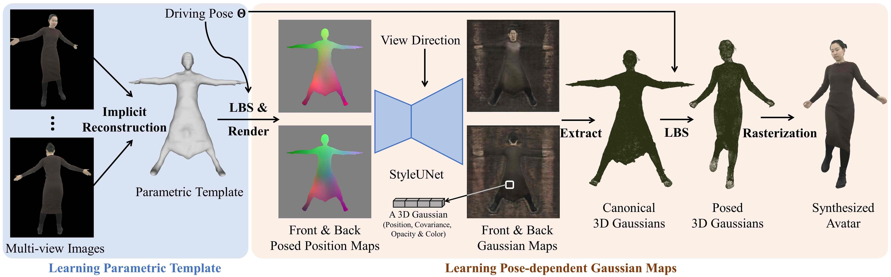

# Animatable Gaussians



## 主要贡献

## 方法解析

### 学习参数化模板

### 模板引导的参数化


为了确保与2D网络兼容，需要将3D模板参数化到2D空间。

给定一个驱动姿态，首先通过LBS将模板变形到posed space（蒙皮过程中不考虑全局变换，因为全局旋转和平移不会改变人体的动态细节），并将变形后的顶点坐标作为canonical模板的顶点颜色，通过**正交投影**渲染到canonical的正面和背面视图，得到两个posed position map。

```python
1. 构建 canonical SMPL-X 模板网格
2. 渲染 canonical SMPL-X 模板的位置图和法线图
3. 计算 canonical 点的 LBS 权重
4. 遍历所有帧，使用 LBS 将 canonical 点变形为 posed 点
5. 存储每一帧的 posed 空间位置图
```


### 依赖于姿态的高斯图

position map作为pose condition，通过StyleUNet（用StyleGAN-based CNN替换NeRF的MLP，更好地建模高频动态）转换成正面和背面的Gaussian map。

参考：[Animatable Gaussians：重建角色的动态服装细节 - 知乎](https://zhuanlan.zhihu.com/p/670064027)


>**项目页面**
>
>Animatable Gaussians：https://animatable-gaussians.github.io/
>
>Animatable and Relightable Gaussians：https://animatable-gaussians.github.io/relight/
>
>AvatarRex数据集：https://liuyebin.com/AvatarRex/
>
>StyleAvatar：https://www.liuyebin.com/styleavatar/styleavatar.html
>
>**参考网页：**
>
>[1] [Animatable Gaussians：重建角色的动态服装细节 - 知乎](https://zhuanlan.zhihu.com/p/670064027)
>
>[2] [Animatable Gaussians：学习姿态依赖的高斯图用于高保真人类化身建模 (全文翻译) - 知乎](https://zhuanlan.zhihu.com/p/669975147)
>
>**Papers:**
>
>[1]  [Animatable Gaussians: Learning Pose-dependent Gaussian Maps for High-fidelity Human Avatar Modeling (CVPR 2024)](papers\AnimatableGaussians.pdf) 
>
>[2] [Animatable and Relightable Gaussians for High-fidelity Human Avatar Modeling](https://arxiv.org/abs/2311.16096)
