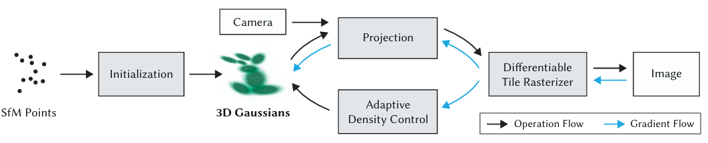
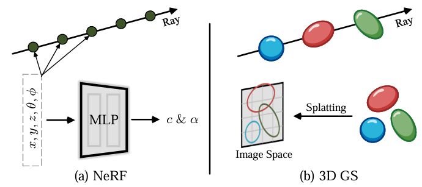
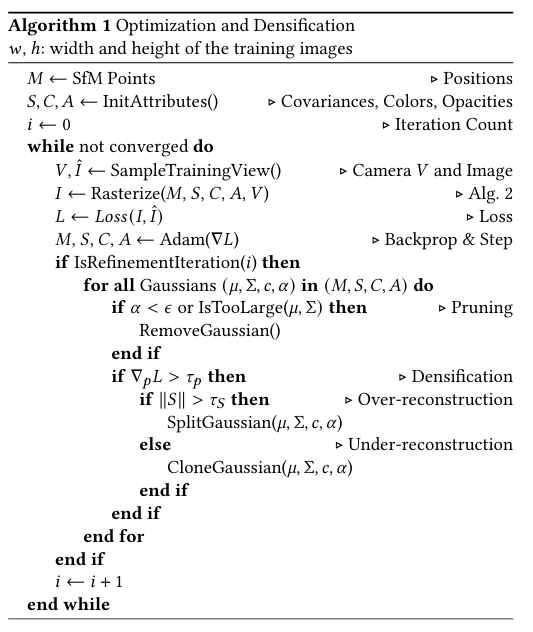

# 3D Gaussian Splatting (3DGS)

## 正向渲染

**3DGS的属性：**${(\mu,\Sigma,c,\alpha)}$ , 位置中心$\mu$，不透明度$\alpha$，3D协方差矩阵$\Sigma$、颜色$c$ (可由球谐函数表示)

**Splatting泼溅：**三维空间中的3D高斯椭球投影到2D图像空间(椭圆)进行渲染

NeRF和3DGS对比

**Tiles (Patches)**：为避免逐像素计算的成本，3DGS改为patch级别的渲染。首先将图像分割为多个不重叠的`patch`，称为`tile`，每个图块包含 16×16 像素，然后确定`tile`与投影高斯的相交情况，由于投影高斯可能会与多个`tile`相交，需要进行复制，并为每个复制体分配相关`tile`的标识符。

3DGS的前向过程

## 反向优化

>**Web Pages：**
>
>[3DGS综述以及对3DGS的理解：A Survey on 3D Gaussian Splatting - 知乎 (zhihu.com)](https://zhuanlan.zhihu.com/p/679809915)
>
>**Project Pages:**
>
>[3D Gaussian Splatting for Real-Time Radiance Field Rendering (inria.fr)](https://repo-sam.inria.fr/fungraph/3d-gaussian-splatting/)
>
>**Papers:**
>
>[1] [3D Gaussian Splatting for Real-Time Radiance Field Rendering (2023)](https://arxiv.org/abs/2308.04079) ([pdf](./papers/3DGS.pdf))
>
>[2] [A Survey on 3D Gaussian Splatting (2024)](https://arxiv.org/abs/2401.03890) ([pdf](./papers/A_Survey_on_3D_Gaussian_Splatting.pdf))
>
>

