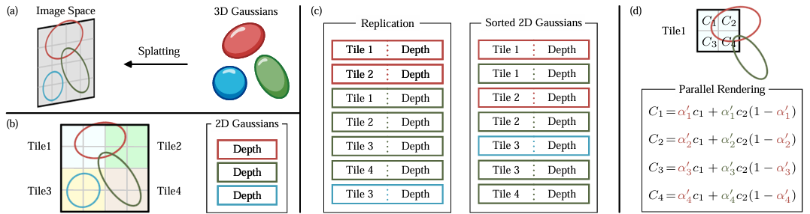

# 3D Gaussian Splatting (3DGS)

## 贡献

- 引入各向异性3D高斯作为高质量、非结构化的辐射场表示方法

- 一种3D高斯属性的优化方法，与自适应密度控制相结合，为捕获的场景创建高质量的表示

- 一种快速、可微分的GPU渲染方法，具有可见性感知能力，允许各向异性splatting和快速反向传播，以实现高质量的新视角合成

## 预备知识

### 辐射场

辐射场是实际上是对三维空间中光分布的表示，它捕捉了光与环境中的表面和材质相互作用的方式。从数学上来说，辐射场可被描述为一个函数

$$
L : {\mathbb{R}^5} \to {\mathbb{R}^+}
$$

其中$L(x,y,z,\theta ,\phi )$将空间点$(x,y,z)$和球坐标$(\theta ,\phi)$指定的方向映射到非负的辐射值。辐射场包含显示表达和隐式表达，可用于场景表达和渲染。

**隐式辐射场**

隐式辐射场在表示场景中的光分布时，不显式定义场景的几何形状。在NeRF中，使用MLP网络将一组空间坐标$(x,y,z)$和观察方向$(\theta ,\phi)$映射到颜色和密度值，任何点的辐射值都不显式存储，而是通过查询MLP实时计算得到

$$
L(x,y,z,\theta ,\phi ) = {\rm{MLP}}(x,y,z,\theta ,\phi )
$$

这种方式的好处是构建了一个可微且紧凑的复杂场景，但由于需要对光线进行采样和体渲染的计算，导致计算负荷比较高。

**显式辐射场**

显式辐射场直接表示光在离散空间结构中的分布，例如体素网格或点云。该结构中的每个元素存储其在空间中各自位置的辐射信息，可以更直接、快速地访问辐射数据，但代价是更高的内存使用和潜在的低分辨率。显式辐射场的一般形式可写成

$$
L(x,y,z,\theta ,\phi ) = {\rm{DataStructure}}[(x,y,z)]f(\theta ,\phi )
$$

其中$\rm{DataStructure}$可以是体素网格或点云$f(\theta ,\phi )$是一个基于观察方向修改辐射的函数。

**3DGS**

3DGS是一种显式辐射场，具有隐式辐射场的优点。将可学习的3D高斯用于场景表达，这些高斯函数在多视图图像的监督下进行优化，以准确表示场景，结合了基于神经网络的优化和显式结构化数据存储的优点。这种混合方法旨在实现实时、高质量的渲染，并且训练时间更短，特别是对于复杂场景和高分辨率输出的情况。3D高斯表达可表示为

$$
L(x,y,z,\theta ,\phi ) = \sum\limits_{i \in N} {{G_i}(x,y,z,{\boldsymbol{\mu}_i},{\boldsymbol{\Sigma}_i}){c_i}(\theta ,\phi )}
$$

其中$G$是均值为${\boldsymbol{\mu}_i}$、协方差为${\boldsymbol{\Sigma}_i}$的高斯函数， $c$表示与视图相关的颜色

## 正向渲染

基于点的渲染：基于点的方法有效地渲染不连续和非结构化的几何样本（点云）

新视角合成

### 3DGS的属性

 ${(\boldsymbol{\mu},\boldsymbol{\Sigma},\boldsymbol{c},\alpha)}$, 所有参数均可通过反向传播来学习和优化

- 中心位置$\boldsymbol{\mu}$

- 3D协方差矩阵$\boldsymbol{\Sigma}$

- 颜色$\boldsymbol{c}$ (可由球谐函数表示)
- 不透明度$\alpha$

### **视域剔除**

给定特定的相机姿态，该步骤会判断哪些高斯位于相机的视锥外，并在后续步骤中剔除之，以节省计算

### Splatting泼溅

NeRF和3DGS的渲染可视作互逆的关系。

**NeRF:** 后向映射 (backward mapping)，沿射线采样，然后查询MLP以获得相应的颜色和不透明度

**3DGS:** 前向映射 (forward mapping)，将所有3D高斯投影到图像空间 (即splatting)，然后并行渲染

<figure style="text-align: center;">
  <figcaption>NeRF与3DGS</figcaption>
</figure>

Splatting可以理解为三维空间中的3D高斯椭球投影到2D图像空间 (椭圆) 进行渲染的过程。

三维空间中的3D高斯分布由中心位置$\boldsymbol{\mu}$、3D协方差矩阵$\boldsymbol{\Sigma}$定义

$$
G(\boldsymbol{x}) = \exp \left( { - \frac{1}{2}{{(\boldsymbol{x} - \boldsymbol{\mu} )}^{\rm{T}}}{\boldsymbol{\Sigma}^{-1}}(\boldsymbol{x} - \boldsymbol{\mu} )} \right)
$$

给定观察变换矩阵 $\boldsymbol W$ 和3D协方差矩阵$\boldsymbol{\Sigma}$，以及投影变换中仿射近似的雅可比矩阵$\boldsymbol{J}$，图像空间的2D协方差矩阵为

$$
\boldsymbol{\Sigma}' = \boldsymbol{JW\Sigma} {\boldsymbol{W}^{\rm{T}}}{\boldsymbol{J}^{\rm{T}}}
$$

图像空间的2D高斯椭圆为

$$
G(\boldsymbol{x}') = \exp \left( { - \frac{1}{2}{{({\boldsymbol{x}'} - \boldsymbol{\mu}')}^{\rm{T}}}{{{\boldsymbol{\Sigma '}}}^{-1}}({\boldsymbol{x}'} - {\boldsymbol{\mu}'})} \right)
$$
其中$\boldsymbol{x}'$和$\boldsymbol{\mu}'$是图像空间中的坐标。

### 像素渲染

给定像素点$\boldsymbol{x}'$，通过观察变换 $\boldsymbol W$ 可以计算出像素点到所有重叠高斯点的距离，即这些高斯点的深度，形成高斯点的排序列表$\cal N$，通过𝛼-blending计算该像素的最终颜色

$$
\boldsymbol{C} = \sum\limits_{i \in {\cal N}} {{\boldsymbol{c}_i}{\alpha _i}{G_i}(\boldsymbol{x}')\prod\limits_{j = 1}^{i - 1} {(1 - {\alpha _j}{G_j}(\boldsymbol{x}'))} }
$$

### 快速可微光栅化

**Tiles (Patches)**：为避免逐像素计算的成本，3DGS改为patch级别的渲染。首先将图像分割为多个不重叠的`patch`，称为`tile`，每个图块包含 16×16 像素，然后确定`tile`与投影高斯的相交情况，由于投影高斯可能会与多个`tile`相交，需要进行复制，并为每个复制体分配相关`tile`的标识符。

<figure style="text-align: center;">
  <figcaption>3DGS的前向过程</figcaption>
</figure>
**多线程渲染**

## 反向传播优化

### 优化

3DGS的所有参数 ${(\boldsymbol{\mu},\boldsymbol{\Sigma},\boldsymbol{c},\alpha)}$ 均通过反向传播来学习和优化，使用随机梯度下降 (Stochastic Gradient Descent, SGD) 进行优化。

3DGS的大多数属性可以直接通过反向传播进行优化，但直接优化协方差矩阵会导致非半正定矩阵，这不符合通常与协方差矩阵相关的物理解释。

为保证协方差矩阵的半正定性，使用缩放矩阵$\boldsymbol{S}$和旋转矩阵$\boldsymbol{R}$来表达协方差矩阵，优化四元数$\boldsymbol q$和3D向量$\boldsymbol s$，初始协方差矩阵估计为各向同性高斯矩阵，其轴等于到最近的三个点的距离的平均值

$$
\boldsymbol{\Sigma}  = \boldsymbol{RS}{\boldsymbol{S}^{\rm{T}}}{\boldsymbol{R}^{\rm{T}}}
$$

计算渲染图像和真实图像的差异，损失函数

$$
{\cal L} = {\rm{ }}\left( {1{\rm{ }} - {\rm{ }}\lambda } \right){{\cal L}_1}{\rm{ }} + {\rm{ }}\lambda {{\cal L}_{{\rm{D - SSIM}}}}
$$

### 自适应密度控制

- **初始化**

3DGS从SfM生成的稀疏点云初始化或随机初始化高斯，然后采用点密集化和剪枝来控制3D高斯的密度。良好的初始化对于收敛和重建质量至关重要。

- **点密集化 (Densification)**

在点密集化阶段，3DGS自适应地增加高斯的密度，以更好地捕捉场景细节。密集化在一定数量的训练迭代后执行（比如每100次迭代），针对在观察空间中具有较大位置梯度的高斯。这一步旨在在3D空间中寻求高斯的最佳分布和表示，提升重建的整体质量。

**关注对象：**重建不足缺失几何特征的区域，高斯覆盖场景中大面积的区域。它们的共同特点：属于在观察空间中具有较大位置梯度（超过特定阈值）的高斯

**高斯的克隆和分裂：**

①在重建不足的区域克隆小高斯：创建高斯的复制体并沿着位置梯度方向移动。

②在过度重建的区域分裂大高斯：用两个较小的高斯替换一个大高斯，按照特定因子$({\phi = 1.6})$减小它们的尺度。

- **点的剪枝 (Pruning)**

点的剪枝阶段移除冗余或影响较小的高斯，可以看作是一种正则化过程。通过剪枝消除几乎透明的高斯和在世界空间或观察空间中非常大的高斯。此外，为防止相机附近的高斯密度不合理地增加，这些高斯会在固定次数的迭代后将$\alpha$设置为接近0的值。该过程在保证高斯的精度和有效性的情况下，节约计算资源。

**关注对象：**几乎透明的高斯（α低于指定阈值）和在世界空间或观察空间中非常大的高斯

>**Web Pages：**
>
>[3DGS综述以及对3DGS的理解：A Survey on 3D Gaussian Splatting - 知乎 (zhihu.com)](https://zhuanlan.zhihu.com/p/679809915)
>
>**Project Pages:**
>
>[3D Gaussian Splatting for Real-Time Radiance Field Rendering (inria.fr)](https://repo-sam.inria.fr/fungraph/3d-gaussian-splatting/)
>
>**Papers:**
>
>[1] [3D Gaussian Splatting for Real-Time Radiance Field Rendering (2023)](https://arxiv.org/abs/2308.04079) ([pdf](./papers/3DGS.pdf))
>
>[2] [A Survey on 3D Gaussian Splatting (2024)](https://arxiv.org/abs/2401.03890) ([pdf](./papers/A_Survey_on_3D_Gaussian_Splatting.pdf))
>
>

