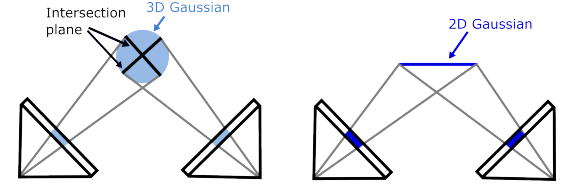

# [2D Gaussian Splatting](https://surfsplatting.github.io/)

## 主要贡献

- 

## 3DGS的问题

（1）膨胀的3D高斯椭球与实际场景表面的薄特性相冲突

（2）3DGS本身并不建模表面法线，而这对于高质量的表面重建至关重要

（3）3DGS中的光栅化过程缺乏多视角一致性，导致不同视角的2D交叉平面各不相同

## 方法解析

### 建模

通过在3D空间中嵌入“平面”高斯函数来简化三维建模，在二维高斯模型中，基元将密度分布在平面圆盘内，并将法线定义为密度变化最大的方向，这种方法可以更好地将高斯与薄表面对齐。

2D高斯的特征: 中心点${\boldsymbol{p}_k}$，两个主切向量${\boldsymbol{t}_u}、{\boldsymbol{t}_v}$，控制2D高斯方差的缩放向量$({s_u},{s_v})$，都是可学习的参数

法线: ${\boldsymbol{t}_w} = {\boldsymbol{t}_u} \times {\boldsymbol{t}_v}$

旋转矩阵: $\boldsymbol{R} = ({\boldsymbol{t}_u},{\boldsymbol{t}_v},{\boldsymbol{t}_w})$

缩放矩阵: $\boldsymbol{S} = {\rm{diag}}({s_u},{s_v},0)$

在世界空间的局部切平面上定义二维高斯函数，其参数化为：
$$
\begin{array}{l}
P(u,v) = {\boldsymbol{p}_k} + {s_u}{\boldsymbol{t}_u}u + {s_v}{\boldsymbol{t}_v}v = \boldsymbol{H}{(u,v,1,1)^{\rm{T}}}\\
\boldsymbol{H} = \left[ {\begin{array}{*{20}{c}}
{{s_u}{\boldsymbol{t}_u}}&{{s_v}{\boldsymbol{t}_v}}&0&{{\boldsymbol{p}_k}}\\
0&0&0&1
\end{array}} \right] = \left[ {\begin{array}{*{20}{c}}
{\boldsymbol{RS}}&{{\boldsymbol{p}_k}}\\
0&1
\end{array}} \right]
\end{array}
$$
其中**H**∈4×4是表示二维高斯几何的齐次变换矩阵。对于𝑢𝑣空间中的点(𝑢, 𝑣)，则可以用标准高斯函数求其二维高斯值
$$
{\cal G}(\boldsymbol{u}) = \exp \left( { - \frac{{{u^2} + {v^2}}}{2}} \right)
$$

### Splatting泼溅

### 训练

>**Web Pages：**
>
>
>
>**Project Pages:**
>
>
>
>**Papers:**
>
>[1] [2D Gaussian Splatting for Geometrically Accurate Radiance Fields (2024)](https://arxiv.org/abs/2403.17888) ([pdf](./papers/2DGS.pdf))

