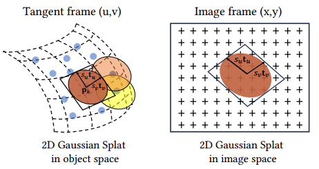

# [Gaussian Opacity Fields (GOF)](https://github.com/autonomousvision/gaussian-opacity-fields)

## 主要贡献

- 

## 方法解析

### 建模

通过在3D空间中嵌入“平面”高斯函数来简化三维建模，在二维高斯模型中，基元将密度分布在平面圆盘内，并将法线定义为密度变化最大的方向，这种方法可以更好地将高斯与薄表面对齐。

2D高斯的特征: 中心点${\boldsymbol{p}_k}$，两个主切向量${\boldsymbol{t}_u}、{\boldsymbol{t}_v}$，控制2D高斯方差的缩放向量$({s_u},{s_v})$，都是可学习的参数

法线: ${\boldsymbol{t}_w} = {\boldsymbol{t}_u} \times {\boldsymbol{t}_v}$

旋转矩阵: $\boldsymbol{R} = ({\boldsymbol{t}_u},{\boldsymbol{t}_v},{\boldsymbol{t}_w})$

缩放矩阵: $\boldsymbol{S} = {\rm{diag}}({s_u},{s_v},0)$

在世界空间的局部切平面上定义二维高斯函数，其参数化为：
$$
\begin{array}{l}
P(u,v) = {\boldsymbol{p}_k} + {s_u}{\boldsymbol{t}_u}u + {s_v}{\boldsymbol{t}_v}v = \boldsymbol{H}{(u,v,1,1)^{\rm{T}}}\\
\boldsymbol{H} = \left[ {\begin{array}{*{20}{c}}
{{s_u}{\boldsymbol{t}_u}}&{{s_v}{\boldsymbol{t}_v}}&0&{{\boldsymbol{p}_k}}\\
0&0&0&1
\end{array}} \right] = \left[ {\begin{array}{*{20}{c}}
{\boldsymbol{RS}}&{{\boldsymbol{p}_k}}\\
0&1
\end{array}} \right]
\end{array}
$$
其中${\boldsymbol{H} \in 4 \times 4}$是表示二维高斯几何的齐次变换矩阵。对于𝑢𝑣空间中的点(𝑢, 𝑣)，则可以用标准高斯函数求其二维高斯值
$$
{\mathcal G}(\boldsymbol{u}) = \exp \left( { - \frac{{{u^2} + {v^2}}}{2}} \right)
$$

### Splatting泼溅

渲染2D高斯的常用策略是使用透视投影的仿射近似将2D高斯基元投影到图像空间上，这种投影仅在高斯中心准确，并且随着到中心距离的增加，近似误差也会增加。为解决该问题，使用齐次坐标下的2D-to-2D映射来描述将2D高斯投影到图像平面的过程，令${\boldsymbol{W} \in 4 \times 4}$为世界空间到屏幕空间的变换矩阵，从相机发出的均匀射线穿过像素(x,y)并在深度z处与2D高斯相交的屏幕空间点可表示为
$$
\boldsymbol{x} = {(xz,yz,z,1)^{\rm{T}}} = {\boldsymbol{W}P}(u,v) = \boldsymbol{WH}{(u,v,1,1)^{\rm{T}}}
$$

#### Ray-splat Intersection

为了栅格化2D高斯，逆变换${\boldsymbol{M} = \boldsymbol{W} \boldsymbol{H} ^ {-1}}$这种隐式方法将2D高斯投影到屏幕空间中，但逆变换引入了数值不稳定性，为解决该问题，2DGS提出了显式的Ray-splat Intersection方法。

将像素 (x,y) 的射线参数化为两个正交平面的交集：

x平面：四维齐次平面 ${\boldsymbol{h}_x} = {(-1,0,0,x)^{\rm{T}}}$，由一个法向量 (-1,0,0) 和一个偏移量x定义

y平面：四维齐次平面 ${\boldsymbol{h}_y} = {(0,-1,0,y)^{\rm{T}}}$，由一个法向量 (0,-1,0) 和一个偏移量y 定义

#### 2D高斯退化问题

当从倾斜的角度观察2D高斯时，它会退化为屏幕空间中的一条线。因此，在光栅化过程中可能会遗漏它。为了处理这些情况并稳定优化，引入物体空间 (object-space) 的低通滤波器

$$
{\hat{\mathcal G}}(\boldsymbol{x}) = \max \left( {{\mathcal G}(\boldsymbol{u}(\boldsymbol{x})),{\mathcal G}\left( {\frac{\boldsymbol{x} - \boldsymbol{c}}{\sigma }} \right)} \right)
$$

#### 光栅化

$$
\boldsymbol{c}(\boldsymbol{x}) = \sum\limits_{i \in {\cal N}} {{{\boldsymbol{c}}_i}{\alpha _i}{{\hat {\mathcal G}}_i}({\boldsymbol{u}}({\bf{x}}))\prod\limits_{j = 1}^{i - 1} {(1 - {\alpha _j}{{\hat {\mathcal G}}_j}({\boldsymbol{u}}({\boldsymbol{x}})))} }
$$

### 训练

#### 深度正则化

3DGS的体渲染不考虑intersected高斯基元之间的距离，分散的高斯可能会产生相似的颜色和深度渲染，即体渲染过程中没有准确地对表面部分进行渲染，通过最小化沿射线分布的ray-splat intersection之间的距离，来集中射线的权重分布到实际表面，深度损失如下
$$
\begin{array}{l}
{{\cal L}_d} = \sum\limits_{i,j} {{w_i}{w_j}\left| {{z_i} - {z_j}} \right|} \\
{w_i} = {\alpha _i}{\widehat {\mathcal G}_i}({\boldsymbol{u}}({\boldsymbol{x}}))\prod\limits_{j = 1}^{i - 1} {(1 - {\alpha _j}{{\widehat {\mathcal G}}_j}({\boldsymbol{u}}({\boldsymbol{x}})))} 
\end{array}
$$
其中${w_i}$是第i个intersection的blending权值。

#### 法线一致性正则化

为确保2D高斯splat在局部与实际表面对齐，将2D高斯splat的法线与深度图的梯度对齐，构造法线一致性损失
$$
{{\mathcal L}_n} = \sum\limits_i {{w_i}(1 - \boldsymbol{n}_i^{\rm{T}}{\boldsymbol{N}})}
$$
$\boldsymbol{n}_i$是splat朝向相机方向的法线，$\boldsymbol N$是根据深度图的梯度估计的归一化法线
$$
\boldsymbol{N} = \frac{{{\nabla _x}{\boldsymbol{p}_s} \times {\nabla _y}{\boldsymbol{p}_s}}}{{\left| {{\nabla _x}{\boldsymbol{p}_s} \times {\nabla _y}{\boldsymbol{p}_s}} \right|}}
$$

#### 损失函数

$$
{\mathcal L} = {{\mathcal L}_c} + {{\mathcal L}_d} + {{\mathcal L}_n}
$$

