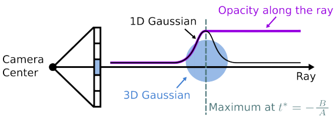

# [Gaussian Opacity Fields (GOF)](https://github.com/autonomousvision/gaussian-opacity-fields)

## 主要贡献

- 

## 方法解析

### 建模

#### Ray Gaussian Intersection

不采用将3D高斯投影到2D屏幕空间并在2D空间中评估高斯的方法，因为3D到2D投影过程中会丢失3D信息，而是通过显式的ray-Gaussian intersection来评估高斯对射线的贡献，这能够评估任意3D点的不透明度值。

将ray-Gaussian intersection定义为高斯函数沿射线达到最大值的点。

给定相机中心 ${\boldsymbol{o} \in \mathbb{R}^3}$、射线方向 ${\boldsymbol{r} \in \mathbb{R}^3}$，3D点可表示为 $\boldsymbol{x} = \boldsymbol{o} + {t}{\boldsymbol{r}}$，其中 𝑡 为射线深度，将点 $\boldsymbol{x}$ 转换到由位置 ${\boldsymbol{p}_k}$ 、尺度 ${\boldsymbol{S}_k}$ 和旋转 ${\boldsymbol{R}_k}$ 定义的3D高斯 ${{\mathcal G}_k}$ 的局部坐标系下
$$
\begin{array}{l}
{\boldsymbol{o}_g} = \boldsymbol{S}_k^{-1}{\boldsymbol{R}_k}(\boldsymbol{o} - {\boldsymbol{p}_k})\\
{\boldsymbol{r}_g} = \boldsymbol{S}_k^{-1}{\boldsymbol{R}_k}{\boldsymbol{r}}\\
{\boldsymbol{x}_g} = {\boldsymbol{o}_g} + t{\boldsymbol{r}_g}
\end{array}
$$

在该局部坐标系下，沿射线任意点处的高斯值变为一维高斯值
$$
{\mathcal G}_k^{1D}(t) 
= \exp \left( { - \frac{1}{2}{\boldsymbol{x}}_g^{\rm{T}}{\boldsymbol{x}_g}} \right) 
= \exp \left( { - \frac{1}{2}\left( {\boldsymbol{r}_g^{\rm{T}}{\boldsymbol{r}_g}{t^2} + 2{\boldsymbol{o}}_g^{\rm{T}}{\boldsymbol{r}_g}t + {\boldsymbol{o}}_g^{\rm{T}}{\boldsymbol{o}_g}} \right)} \right)
$$
该函数在 ${t^*}$ 处得到最大值
$$
{t^*} =  - \frac{A}{B}, {\ }
A = {\boldsymbol{r}}_g^{\rm{T}}{\boldsymbol{r}_g}, {\ }
B = {\boldsymbol{o}}_g^{\rm{T}}{\boldsymbol{r}_g}
$$
定义高斯函数 ${{\mathcal G}_k}$ 对给定相机中心 ${\boldsymbol o}$ 和射线方向 ${\boldsymbol r}$ 的贡献为
$$
{\mathcal E}({{\mathcal G}_k},{\boldsymbol{o}},{\boldsymbol{r}}) = {\mathcal G}_k^{1D}({t^*})
$$

#### 体渲染

使用显式ray-Gaussian intersection而不是投影的一个显著好处是它允许评估沿射线的任意3D点的不透明度值或透射率。

在沿射线只有一个高斯的情况下，将沿射线的任意3D点 $\boldsymbol{x} = \boldsymbol{o} + {t}{\boldsymbol{r}}$ 的不透明度定义如下式，不透明度沿射线增加到最大值后将保持不变
$$
{\boldsymbol{O}_k}({{\mathcal G}_k},{\boldsymbol{o}},{\boldsymbol{r}},t) = \left\{ {\begin{array}{*{20}{c}}
{{\mathcal G}_k^{1D}(t)}&{if(t \le {t^*})}\\
{{\mathcal G}_k^{1D}({t^*})}&{f(t > {t^*})}
\end{array}} \right.
$$
给定一组高斯分布的情况下，沿射线的任意点的不透明度为

$$
{\boldsymbol{O}}({\boldsymbol{o}},{\boldsymbol{r}},t) = 
\sum\limits_{k = 1}^K {{{\boldsymbol{c}}_k}{\alpha _k}{\boldsymbol{O}_k}({{\mathcal G}_k},{\boldsymbol{o}},{\boldsymbol{r}},t)\prod\limits_{j = 1}^{k - 1} {(1 - {\alpha _j}{\boldsymbol{O}_j}({{\mathcal G}_j},{\boldsymbol{o}},{\boldsymbol{r}},t))} }
$$

将3D点 $\boldsymbol{x}$ 的不透明度定义为所有训练视角或观察方向中的最小不透明度值，即高斯不透明场
$$
{\boldsymbol{O}}(x) = 
\mathop {\rm{min}}\limits_{({\boldsymbol{O}},\boldsymbol{r})} {\boldsymbol{O}}({\boldsymbol{o}},{\boldsymbol{r}},t)
$$

### 高斯不透明场

#### Ray-splat Intersection

#### 2D高斯退化问题

当从倾斜的角度观察2D高斯时，它会退化为屏幕空间中的一条线。因此，在光栅化过程中可能会遗漏它。为了处理这些情况并稳定优化，引入物体空间 (object-space) 的低通滤波器

$$
{\hat{\mathcal G}}(\boldsymbol{x}) = \max \left( {{\mathcal G}(\boldsymbol{u}(\boldsymbol{x})),{\mathcal G}\left( {\frac{\boldsymbol{x} - \boldsymbol{c}}{\sigma }} \right)} \right)
$$

#### 体渲染

$$
\boldsymbol{c}(\boldsymbol{x}) = \sum\limits_{i \in {\cal N}} {{{\boldsymbol{c}}_i}{\alpha _i}{{\hat {\mathcal G}}_i}({\boldsymbol{u}}({\bf{x}}))\prod\limits_{j = 1}^{i - 1} {(1 - {\alpha _j}{{\hat {\mathcal G}}_j}({\boldsymbol{u}}({\boldsymbol{x}})))} }
$$

### 训练

#### 深度正则化

3DGS的体渲染不考虑intersected高斯基元之间的距离，分散的高斯可能会产生相似的颜色和深度渲染，即体渲染过程中没有准确地对表面部分进行渲染，通过最小化沿射线分布的ray-splat intersection之间的距离，来集中射线的权重分布到实际表面，深度损失如下
$$
\begin{array}{l}
{{\cal L}_d} = \sum\limits_{i,j} {{w_i}{w_j}\left| {{z_i} - {z_j}} \right|} \\
{w_i} = {\alpha _i}{\widehat {\mathcal G}_i}({\boldsymbol{u}}({\boldsymbol{x}}))\prod\limits_{j = 1}^{i - 1} {(1 - {\alpha _j}{{\widehat {\mathcal G}}_j}({\boldsymbol{u}}({\boldsymbol{x}})))} 
\end{array}
$$
其中 ${w_i}$ 是第 𝑖 个intersection的blending权值。

#### 法线一致性正则化

为确保2D高斯splat在局部与实际表面对齐，将2D高斯splat的法线与深度图的梯度对齐，构造法线一致性损失
$$
{{\mathcal L}_n} = \sum\limits_i {{w_i}(1 - \boldsymbol{n}_i^{\rm{T}}{\boldsymbol{N}})}
$$
$\boldsymbol{n}_i$是splat朝向相机方向的法线，$\boldsymbol N$是根据深度图的梯度估计的归一化法线
$$
\boldsymbol{N} = \frac{{{\nabla _x}{\boldsymbol{p}_s} \times {\nabla _y}{\boldsymbol{p}_s}}}{{\left| {{\nabla _x}{\boldsymbol{p}_s} \times {\nabla _y}{\boldsymbol{p}_s}} \right|}}
$$

#### 损失函数

$$
{\mathcal L} = {{\mathcal L}_c} + {{\mathcal L}_d} + {{\mathcal L}_n}
$$

