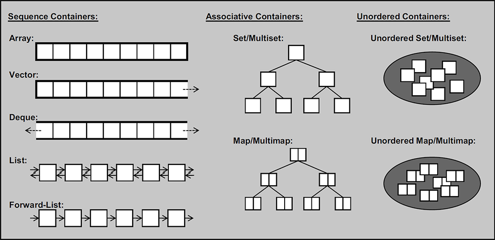

[TOC]

# STL容器



[OI Wiki: STL 容器简介](https://oi-wiki.org/lang/csl/container/)

[Microsoft: STL 容器](https://learn.microsoft.com/zh-cn/previous-versions/1fe2x6kt(v=vs.120))

## 序列容器

| 容器                     | 描述                                         | 数据结构           |
| ------------------------ | -------------------------------------------- | ------------------ |
| 数组（array）            | 定长的顺序表，C 风格数组的简单包装           | 内存连续、固定长度 |
| 向量（vector）           | 随机访问、连续存储、长度灵活，可变长度的数组 | 栈？？？？？，     |
| 双端队列（deque）        | 双端都可高效增加元素的顺序表                 |                    |
| 双向链表（list）         | 是循环链表吗？？？？？？？？？？？？？？     |                    |
| 单向链表（forward_list） |                                              |                    |

### 数组array

### 向量vector

#### 构造函数与初始化

#### 元素访问

| 函数         | 功能描述                                                     |
| :----------- | :----------------------------------------------------------- |
| `at()`       | `v.at(pos)` 返回容器中下标为 `pos` 的引用。如果数组越界抛出 `std::out_of_range` 类型的异常 |
| `operator[]` | `v[pos]`返回容器中下标为 `pos` 的引用。不执行越界检查        |
| `front()`    | `v.front()` 返回首元素的引用                                 |
| `back()`     | `v.back()` 返回末尾元素的引用                                |
| `data()`     | `v.data()` 返回指向数组第一个元素的指针                      |

#### 赋值

#### 遍历

https://www.cnblogs.com/txtp/p/15813597.html

下标、迭代器、auto迭代器、for range；哪个最快？？？

```{note}
如果在遍历过程中涉及删除容器内的元素，建议使用迭代器遍历，使用下标operator[]遍历时容器的size会发生变化
```


可以直接通过下标访问元素，查找复杂度O(1)????????

#### 查找和排序

find()

最大最小值

排序

#### 增删和修改

vector.insert与push_back

vector::push_back是深拷贝还是浅拷贝？如果是类的话会调用拷贝构造函数？如果是基本数据类型是深拷贝还是浅拷贝呢？

```{note}
`vector`只支持从末尾`push_back`和`pop_back`，没有`push_front`和`pop_front`
```

****

| 函数          | 功能描述                                                     |
| :------------ | :----------------------------------------------------------- |
| `clear()`     | 清除所有元素                                                 |
| `insert()`    | 在给定迭代器**位置前**插入元素、可以插入多个。**复杂度与 `pos` 距离末尾长度成线性而非常数** |
| `erase()`     | 删除某个迭代器或者区间的元素，返回最后被删除的迭代器。复杂度与 `insert` 一致 |
| `push_back()` | 在末尾插入一个元素，均摊复杂度为 **常数**，最坏为线性复杂度  |
| `pop_back()`  | 删除末尾元素，常数复杂度                                     |
| `swap()`      | 与另一个容器进行交换，此操作是 **常数复杂度** 而非线性的     |

#### 长度和容量

- **size() 和 capacity()**

`vector` 的长度（size）指有效元素数量，而容量（capacity）指其实际分配的内存长度

- **resize() 和 reserve()**

resize(n)后push_back是接在第n个元素后面，reserve(n)后push_back是从首个元素开始

##### 长度

| 函数         | 功能描述                                                     |
| :----------- | ------------------------------------------------------------ |
| `empty()`    | 返回一个 `bool` 值，即 `v.begin() == v.end()`，`true` 为空，`false` 为非空 |
| `size()`     | 返回容器长度（元素数量），即 `std::distance(v.begin(), v.end())` |
| `resize()`   | 改变 `vector` 的长度，多退少补。补充元素可以由参数指定       |
| `max_size()` | 返回容器的最大可能长度                                       |
|              |                                                              |

##### 容量

| 函数              | 功能描述                                                   |
| ----------------- | ---------------------------------------------------------- |
| `reserve()`       | 使得 `vector` 预留一定的内存空间，避免不必要的内存拷贝     |
| `capacity()`      | 返回容器的容量，即不发生拷贝的情况下容器的长度上限         |
| `shrink_to_fit()` | 放弃额外容量，使得 `vector` 的容量与长度一致，多退但不会少 |


### 双端队列deque

队列可以通过链表和数组实现？？？？？https://blog.csdn.net/tzs_1041218129/article/details/52311387

## 关联容器

| 容器                 | 描述 |      |
| -------------------- | ---- | ---- |
| 集合（set）          |      |      |
| 多重集合（multiset） |      |      |
| 映射（map）          |      |      |
| 多重映射（multimap） |      |      |


### set 与 unordered_set

[set容器自定义数据类型的自定义排序](https://blog.csdn.net/prolop87/article/details/124364102)

如果容器里面是自定义的数据类型比如说类，则需要自定义排序方法？？

### set

### unordered_set

### map与unordered_map

map容器插入数据的方式（四种方式？）

make_pair<>()

pair<>

### map

```{note}
`const map`容器不能通过下标[]访问元素??map容器可以通过const迭代器遍历
const类型的关联容器都不能通过下标访问元素？？
const类型的序列容器可以通过下标访问元素，但不能更改元素值？？
```


### unordered_map

shrink_to_fit()

capacity()和size()

unordered_set、unordered_map与set、map的区别

pair.swap

| STL容器       | 复杂度（效率） |      |
| ------------- | -------------- | ---- |
| vector        | 查找：插入：   |      |
| list          |                |      |
| set           |                |      |
| unordered_set |                |      |
| map           |                |      |
| unordered_set |                |      |
|               |                |      |

| STL容器      |                           简介说明                           |
| ------------ | :----------------------------------------------------------: |
| vector       | 可变大小数组。相当于数组，可动态构建，支持随机访问，无头插和尾插，仅支持inset插入，除尾部外的元素删除比较麻烦。但使用最为广泛 |
| deque        | 双端队列。支持头插、删，尾插、删，随机访问较vector容器来说慢,但对于首尾的数据操作比较方便 |
| list         | 双向循环链表。使用起来很高效，对于任意位置的插入和删除都很快，在操作过后，以后指针、迭代器、引用都不会失效 |
| forward_list | 单向链表。只支持单向访问，在链表的任何位置进行插入/删除操作都非常快 |
| array        | 固定数组。vector的底层即为array数组，它保存了一个以严格顺序排列的特定数量的元素 |

## string

参数：

```C++
string::npos
```


### 初始化

## 迭代器

const迭代器

下标、迭代器、auto迭代器、for range；哪个最快？？
