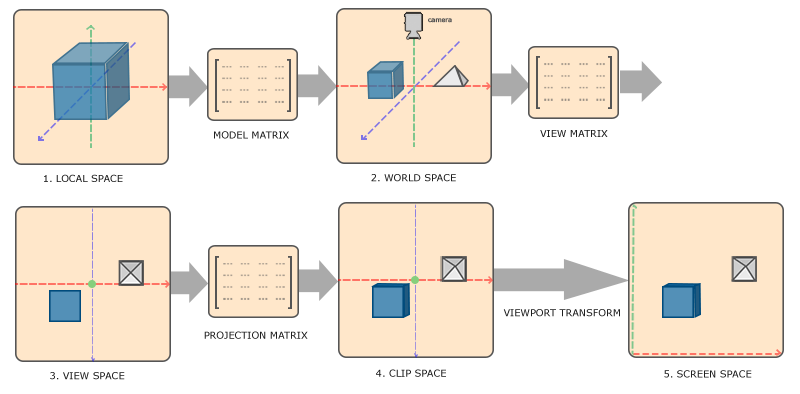

# OpenGL

**参考资料：**[主页 - LearnOpenGL CN (learnopengl-cn.github.io)](https://learnopengl-cn.github.io/)

## 坐标系统

计算机图形学

CG坐标系和CV坐标系

三个重要的变换矩阵：模型(Model)矩阵、观察(View)矩阵、投影(Projection)矩阵




$$
{\boldsymbol{M}_{projection}} = \left[ {\begin{array}{*{20}{c}}
{{m_0}}&0&{{m_1}}&0\\
0&{{m_2}}&{{m_3}}&0\\
0&0&{{m_4}}&{{m_5}}\\
0&0&{-1}&0
\end{array}} \right],{\ }
{\boldsymbol{M}_{reverseYZ}} = \left[ {\begin{array}{*{20}{c}}
1&0&0&0\\
0&{-1}&0&0\\
0&0&{-1}&0\\
0&0&0&1
\end{array}} \right],{\ }
{\boldsymbol{M}_{view}} = {\boldsymbol{M}_{reverseYZ}}{\boldsymbol{T}_{cw}}
$$

**局部空间 (Local Space)，或称物体空间(Object Space)：** 局部坐标系

**世界空间 (World Space): ** 世界坐标系

**观察空间 (View Space)：** 也称为摄像机空间(Camera Space)或视觉空间(Eye Space)，相机坐标系

**裁剪空间 (Clip Space)：** 裁剪后的观察空间，相机坐标系
$$
{\left[ {\begin{array}{*{20}{c}}
x\\
y\\
z\\
w
\end{array}} \right]_{clip}} = {\boldsymbol{M}_{projection}}{\boldsymbol{M}_{view}}{\left[ {\begin{array}{*{20}{c}}
x\\
y\\
z\\
w
\end{array}} \right]_{world}} = {\boldsymbol{M}_{projection}}{\boldsymbol{M}_{reverseYZ}}{\boldsymbol{T}_{cw}}{\left[ {\begin{array}{*{20}{c}}
x\\
y\\
z\\
w
\end{array}} \right]_{world}} = {\boldsymbol{M}_{projection}}{\boldsymbol{M}_{reverseYZ}}{\left[ {\begin{array}{*{20}{c}}
x\\
y\\
z\\
w
\end{array}} \right]_{cam}}
$$


**标准设备空间 (Normalized Device Coordinate, NDC)**：

**屏幕空间 (Screen Space)**：

## 深度测试

常用设置：

```C++
glViewport
glEnable(GL_DEPTH_TEST);
glDepthMask(GL_FALSE);
glDepthFunc(GL_LESS);
glClear(GL_COLOR_BUFFER_BIT | GL_DEPTH_BUFFER_BIT);
```

GLEW

GLFW

GLAD

GLES


