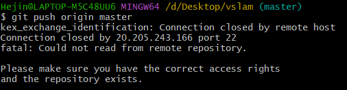

[TOC]

**官方文档：https://git-scm.com/docs**

**菜鸟教程：https://www.runoob.com/git/git-tutorial.html**

# Git

## git配置

### 用户名和密码

```bash
git config --global user.name "hejixin"
git config --global user.email hejinxin_@outlook.com
```

### 公私钥

```bash
ssh-keygen -t rsa  # 然后一直Enter默认选项
# 或者采用如下方式
ssh-keygen -t rsa -C "hejinxin_@outlook.com"

ssh -T git@github.com
```

`id_rsa` 私钥

`id_rsa.pub` 公钥

是什么？？？

## 工作区、暂存区和版本库


[**菜鸟教程：Git 工作区、暂存区和版本库**](https://www.runoob.com/git/git-workspace-index-repo.html)

[**菜鸟教程：Git 基本操作**](https://www.runoob.com/git/git-basic-operations.html)

## 获取和创建项目

### git init

```bash
git init    # 创建一个空的git仓库或重新初始化现有的git仓库
git clone   # 将仓库克隆到新目录
```

### git add

[git add .，git add -A，git add -u，git add * 的区别与联系 - 掘金 (juejin.cn)](https://juejin.cn/post/7053831273277554696)

将工作区的内容提交到暂存区

```bash
git add [file1] [file2] ...  # 将指定文件添加到暂存区
git add [dir] ...            # 将指定文件夹添加到暂存区
git add .                    # 将当前目录的所有文件添加到暂存区
```

### git status


### git commit

```bash
git commit -m [message]                      # 将暂存区内容添加到本地仓库中
git commit [file1] [file2] ... -m [message]  # 提交暂存区的指定文件到仓库区
```

## 共享和更新远程项目

### git remote

```bash
git remote [-v | --verbose]                    # [-v | --verbose] 显示远程仓库的详细信息
git remote add <name> <URL>         #  为 <URL> 地址的远程仓库添加一个名为 <name> 的本地仓库，建立链接
git remote rename <old> <new>      # 将名为 <old> 的远程仓库重命名为 <new>
git remote remove <name>                # 删除名为 <name> 的远程仓库
git remote [-v | --verbose] show        # 显示所有远程仓库的信息
git remote [-v | --verbose] show [-n] <name>        # 显示名为 <name> 的远程仓库的信息
```

### git pull

将来自远程仓库的更改合并到当前本地分支中

```bash
git pull origin master
```

### git push

从本地仓库上传文件更新远程仓库

```bash
git push <远程主机名> <本地分支名>:<远程分支名>
git push origin master #将本地的 master 分支推送到 origin 主机的 master 分支
```

**关于`git push`报错的问题**




### 总体流程举例

```bash
echo "# DenseORB_SLAM2" >> README.md
git init
git add README.md
git commit -m "first commit"
git branch -M main
git remote add origin git@github.com:hejinxin0/DenseORB_SLAM2.git
git push -u origin main
```


## git分支管理和git标签

### git branch

官方文档：https://git-scm.com/docs/git-branch

```bash
git branch (-m | -M) [<oldbranch>] <newbranch>
git branch (-c | -C) [<oldbranch>] <newbranch>
git branch (-d | -D) [-r] <branchname>…       # 删除 git分支 ([-r]远程git分支)     
git branch (-r | --remotes)   # 查看远程 git 分支 ？？？？？？？？？？？？？？？
git branch --edit-description [<branchname>]
```

### git checkout

如何更新版本1.0，1.1，1.2 ？

branch和tags

-f强制切换分支？？

## git log
