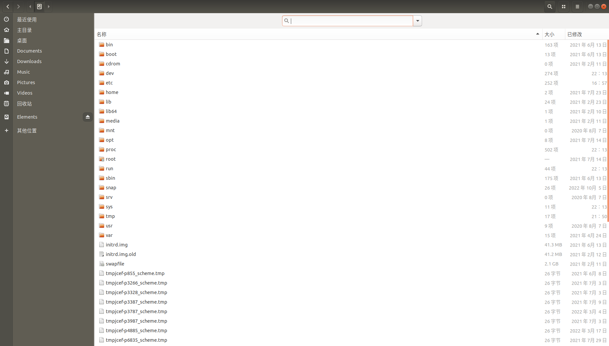

# Linux

ps -aux和top命令查看CPU及内存，  /proc文件中查看cpu和内存信息？？

压缩和解压

tail、cat

grep

pkg-config

环境变量export和env命令、source命令

upgrade命令 

~文件夹代表什么？/home/hejinxin?

## Linux系统目录结构

重新用Visio画一个结构的图，https://www.runoob.com/linux/linux-system-contents.html



## 系统设置与管理

### 环境变量

参数中一横和两横的区别 -help 和 --help

~符号的含义home目录？

环境变量export和env命令、source命令

bashrc环境变量文件，有config配置文件吗

apt-get 与 apt的区别

**/etc/environment**
**/etc/profile**
**~/.bashrc**

**/etc/apt/sources.list**

**/etc/ld.so.conf**和**/sbin/ldconfig -v**是什么

**/etc/passwd**


/proc文件中查看cpu和内存信息？？

设置环境变量命令：

#### export

用于设置或显示环境变量。export 可新增，修改或删除环境变量，供后续执行的程序使用。export 的效力仅限于该次登陆操作

```bash
export [-fnp][变量名称]=[变量设置值]
export PATH
```

取消代理：

```bash
env | grep -i proxy  #列出环境变量
unset no_proxy
unset HTTP_PROXY
unset HTTPS_PROXY
```

**怎么设置代理服务器？？？**

切换源，中科大清华的源

#### source

### CPU、内存和程序

进程与线程的区别、内存、CPU

物理内存与虚拟内存

pid 和 tid 和 lwp 和 tgid

### 磁盘管理

## 用户与用户组管理

### 创建、切换和删除用户

```bash
su
su -
adduser
useradd
userdel
```

## 文件系统与目录管理

### 文件属性与权限

**chown**？？？？？？？？？？？

https://www.runoob.com/linux/linux-file-attr-permission.html

chmod修改权限命令[Linux chmod 命令 | 菜鸟教程 (runoob.com)](https://www.runoob.com/linux/linux-comm-chmod.html)

只有文件所有者和超级用户可以修改文件或目录的权限

chmod+x 和chmod a+x 区别

```bash
chmod [-cfvR] [--help] [--version] mode file...

mode参数
[ugoa...][[+-=][rwxX]...][,...]
```

```{figure} assets/file-permissions-rwx.jpg
---
width: 60%
alt: My figure text
---
```

| who  | 用户类型 |         说明          |
| :--: | :------: | :-------------------: |
| `u`  |   user   |      文件所有者       |
| `g`  |  group   |   文件所有者所在组    |
| `o`  |  others  |     所有其他用户      |
| `a`  |   all    | 所有用户, 相当于`ugo` |


| Operator |                          说明                          |
| :------: | :----------------------------------------------------: |
|   `+`    |                为指定的用户类型增加权限                |
|   `-`    |                 去除指定用户类型的权限                 |
|   `=`    | 设置指定用户权限的设置，即将用户类型的所有权限重新设置 |


| 八进制数字模式 | 符号模式 |    权限说明    | 二进制 |
| :------------: | :------: | :------------: | :----: |
|       7        |  `rwx`   | 读 + 写 + 执行 |  111   |
|       6        |  `rw-`   |    读 + 写     |  110   |
|       5        |  `r-x`   |   读 + 执行    |  101   |
|       4        |  `r--`   |      只读      |  100   |
|       3        |  `-wx`   |   写 + 执行    |  011   |
|       2        |  `-w-`   |      只写      |  010   |
|       1        |  `--x`   |     只执行     |  001   |
|       0        |  `---`   |       无       |  000   |

### 文件目录操作

- `ls` (list files)：列出目录及文件名
- `cd` (change directory)：切换目录
- `pwd`(print work directory)：显示目前的目录
- `mkdir` (make directory)：创建一个新的目录
- `rmdir` (remove directory)：删除一个空的目录
- `cp` (copy file)：复制文件或目录
- `rm` (remove)：删除文件或目录
- `mv` (move file)：移动文件与目录，或修改文件与目录的名称

ls文件颜色[CSDN：ls下文件的颜色](https://blog.csdn.net/weixin_30633949/article/details/95197099)

|   颜色   |       类型       |
| :------: | :--------------: |
|   白色   |     普通文件     |
|   蓝色   |       目录       |
|   绿色   |    可执行文件    |
|   红色   |     压缩文件     |
|  浅蓝色  |     链接文件     |
| 红色闪烁 | 链接的文件有问题 |
|   黄色   |     设备文件     |
|   灰色   |     其他文件     |

https://www.runoob.com/linux/linux-filesystem.html

df命令、du命令、fdisk命令

tree命令以树形结构显示文件夹目录结构

tree如何按先文件夹后文件的顺序显示；如何按字母的顺序显示

```bash
tree 
-L # 目录树的最大显示深度
-d # 只列出文件夹目录
```

分区ext4是什么？

NTFS文件系统

### 查找

| 命令                      | 说明                                                         |
| ------------------------- | ------------------------------------------------------------ |
| `find [path][expression]` | 在指定目录`path`下查找文件和目录                             |
| `locate`                  | 查找符合条件的文档                                           |
| `whereis`                 | 该指令只能用于查找：<br />二进制文件（参数`-b`）、源代码文件（参数`-s`）和man手册页（参数`-m`）<br />一般文件的定位需使用`locate`命令 |
| `which`                   | 在环境变量`$PATH`设置的目录里查找符合条件的文件              |

locate 与 find 不同: find 是去硬盘找，locate 只在 /var/lib/slocate 资料库中找。

locate 的速度比 find 快，它并不是真的查找，而是查数据库

### 软链接

为某一个文件在另外一个位置建立一个同步的链接

```bash
 ln [参数] [源文件或目录] [目标文件或目录]
 
 # 软链接的参数为 -s
 ln -s [源文件或目录] [目标文件或目录]
```

### 压缩与解压

## 文字编辑

vim的用法，查找等用法

## 系统管理

##  包管理工具

安装软件包

### dpkg和apt

```
  apt [options] [command] [package ...]
```

| apt                                                          | apt-get | 说明                                                     |
| ------------------------------------------------------------ | ------- | -------------------------------------------------------- |
| `apt update`                                                 |         | 更新可用软件包列表信息                                   |
| `apt upgrade`                                                |         | 升级软件包                                               |
| `apt install <package_name>`<br />`apt install <package_1> <package_2> ...` |         | 安装新的软件包                                           |
| `apt remove <package_name>`                                  |         | 移除软件包                                               |
| `apt autoremove`                                             |         | 卸载所有自动安装且不再使用的软件包（删除不需要的依赖项） |
| `apt purge <package_name>`                                   |         |                                                          |
| `apt list --installed`<br />`apt list --all-versions`<br />`apt list | grep <package_name>` |         | 根据名称列出软件包                                       |
| `apt show <package_name>`                                    |         | 显示软件包具体信息，例如：版本号，安装大小，依赖关系等   |
| `apt search <keyword>`                                       |         | 搜索与关键词匹配的软件包                                 |


```bash
 sudo apt-get remove --purge 和 sudo apt-get purge
```

```{admonition} 关于 remove 和 purge
https://zhuanlan.zhihu.com/p/600036047
```

apt和**aptitude**https://baike.baidu.com/item/aptitude/6849487

dpkg：https://blog.csdn.net/Kenny_GuanHua/article/details/123842699


pkg-config

### pip和pip3

pip包或者apt包安装超时的问题，--default-timeout=100

```bash
pip3 install --default-timeout=100 --upgrade myst-parser
```

查看pip包信息

```bash
pip list
pip list -V, --version
pip show package_name
```

卸载

```bash
pip uninstall
```

requirements.txt文件。pip生成requirements.txt文件的命令？？

### yum

### conda和anaconda

### snap

```bash
snap list
sudo snap install cloudcompare
sudo snap remove cloudcompare
```


## shell和bash脚本

### 脚本入参

常见的 Shell 有 sh、bash、csh、tcsh、ash 等，bash是shell的一种？？？？

bash和shell的区别？

`#!/bin/bash`的作用

### 脚本的执行方式

`./`和`sh`的区别

### 脚本嵌套（脚本中source）

## 常用IDE

### Python IDE

pycharm

spyder

jupyter

## 常用工具

### curl


### [gcc (GNU Compiler Collection)](../C++ and CMake/编译器与内存.md#gcc (GNU Compiler Collection))（超链接的路径中含有空格怎么处理？？）

## Ubuntu问题总结

### sudo apt-get install 无法获得dpkg前端锁及其解决办法

ubuntu如何安装使用高版本cmake

如何卸载并安装使用高版本eigen

### 找不到 ls 命令（因为环境变量的原因）

### 解决VMware中Ubuntu虚拟机无法连接本机wifi的问题

[(10条消息) 解决VMware中Ubuntu虚拟机无法连接本机wifi的问题_安装vm后本机wifi无法使用_老龙QAQ的博客-CSDN博客](https://blog.csdn.net/weixin_52167116/article/details/123098768?utm_medium=distribute.pc_relevant.none-task-blog-2~default~baidujs_baidulandingword~default-0-123098768-blog-94737546.235^v32^pc_relevant_increate_t0_download_v2&spm=1001.2101.3001.4242.1&utm_relevant_index=3)

### 设置中文拼音输入法

[(10条消息) Ubuntu 18.04 配置ibus中文拼音输入法（超简单）_ibus拼音_难搞哦~的博客-CSDN博客](https://blog.csdn.net/wu10188/article/details/86540464)

### 无法定位软件包
