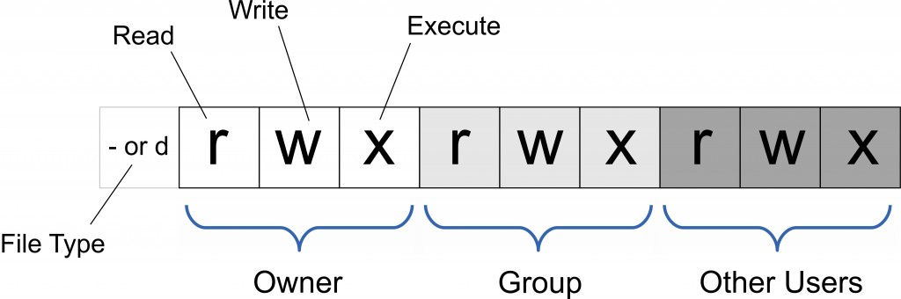

# Linux与工程化

ps -aux和top命令查看CPU及内存，  /proc文件中查看cpu和内存信息？？

ln软连接，软链接ln命令

压缩和解压

tail、cat

grep

pkg-config

环境变量export和env命令、source命令

upgrade命令 

## Linux系统目录结构

重新用Visio画一个结构的图，https://www.runoob.com/linux/linux-system-contents.html


## Ubuntu环境变量文件

参数中一横和两横的区别 -help 和 --help

~符号的含义home目录？

环境变量export和env命令、source命令

bashrc环境变量文件，有config配置文件吗

apt-get 与 apt的区别

**/etc/environment**
**/etc/profile**
**~/.bashrc**

/proc文件中查看cpu和内存信息？？

设置环境变量命令：

```bash
export PATH
```

取消代理：

```bash
env | grep -i proxy  #列出环境变量
unset no_proxy
unset HTTP_PROXY
unset HTTPS_PROXY
```

**怎么设置代理服务器？？？**

切换源，中科大清华的源

## 用户与用户组管理


## 文件系统与目录管理

### 文件属性与权限

https://www.runoob.com/linux/linux-file-attr-permission.html

chmod修改权限命令[Linux chmod 命令 | 菜鸟教程 (runoob.com)](https://www.runoob.com/linux/linux-comm-chmod.html)

只有文件所有者和超级用户可以修改文件或目录的权限

```bash
chmod [-cfvR] [--help] [--version] mode file...

mode参数
[ugoa...][[+-=][rwxX]...][,...]
```



| who  | 用户类型 |         说明          |
| :--: | :------: | :-------------------: |
| `u`  |   user   |      文件所有者       |
| `g`  |  group   |   文件所有者所在组    |
| `o`  |  others  |     所有其他用户      |
| `a`  |   all    | 所有用户, 相当于`ugo` |


| Operator |                          说明                          |
| :------: | :----------------------------------------------------: |
|   `+`    |                为指定的用户类型增加权限                |
|   `-`    |                 去除指定用户类型的权限                 |
|   `=`    | 设置指定用户权限的设置，即将用户类型的所有权限重新设置 |


| 八进制数字模式 | 符号模式 |    权限说明    | 二进制 |
| :------------: | :------: | :------------: | :----: |
|       7        |  `rwx`   | 读 + 写 + 执行 |  111   |
|       6        |  `rw-`   |    读 + 写     |  110   |
|       5        |  `r-x`   |   读 + 执行    |  101   |
|       4        |  `r--`   |      只读      |  100   |
|       3        |  `-wx`   |   写 + 执行    |  011   |
|       2        |  `-w-`   |      只写      |  010   |
|       1        |  `--x`   |     只执行     |  001   |
|       0        |  `---`   |       无       |  000   |

### 文件查看

ls文件颜色[CSDN：ls下文件的颜色](https://blog.csdn.net/weixin_30633949/article/details/95197099)

|   颜色   |       类型       |
| :------: | :--------------: |
|   白色   |     普通文件     |
|   蓝色   |       目录       |
|   绿色   |    可执行文件    |
|   红色   |     压缩文件     |
|  浅蓝色  |     链接文件     |
| 红色闪烁 | 链接的文件有问题 |
|   黄色   |     设备文件     |
|   灰色   |     其他文件     |

https://www.runoob.com/linux/linux-filesystem.html

df命令、du命令、fdisk命令

tree命令以树形结构显示文件夹目录结构

tree如何按先文件夹后文件的顺序显示；如何按字母的顺序显示

```bash
tree 
-L # 目录树的最大显示深度
-d # 只列出文件夹目录
```

分区ext4是什么？

NTFS文件系统

## 文字编辑

## 程序

进程与线程的区别、内存、CPU

物理内存与虚拟内存

pid 和 tid 和 lwp 和 tgid

##  常用操作命令

安装软件包

### snap

```bash
snap list
sudo snap install cloudcompare
sudo snap remove cloudcompare
```

### pip和pip3

pip包或者apt包安装超时的问题，--default-timeout=100

```bash
pip3 install --default-timeout=100 --upgrade myst-parser
```

查看pip包信息

```bash
pip list
pip show package_name
```

卸载

```bash
pip uninstall
```

requirements.txt文件。pip生成requirements.txt文件的命令？？

## shell脚本

常见的 Shell 有 sh、bash、csh、tcsh、ash 等，bash是shell的一种？？？？

## 常用IDE

### Python IDE

pycharm

spyder

jupyter


## 包管理工具

apt-get

```bash
 sudo apt-get remove --purge 和 sudo apt-get purge
```

apt和**aptitude**https://baike.baidu.com/item/aptitude/6849487

dpkg：https://blog.csdn.net/Kenny_GuanHua/article/details/123842699


pkg-config

conda和anaconda

snap

pip

yum 

## 软件程序及第三方库安装

### ros

### cuda

```bash
nvcc -V | --version # 查看cuda版本
```

cmake离线

openmp

pcl

open3d

## docker容器

## 问题总结

sudo apt-get install 无法获得dpkg前端锁及其解决办法

ubuntu如何安装使用高版本cmake

如何卸载并安装使用高版本eigen
