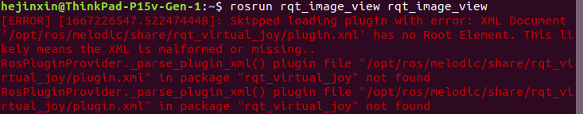

# ROS

## 安装配置与卸载

### 卸载

[CSDN：卸载ROS的方法](https://blog.csdn.net/seniorc/article/details/112276699)

## ROS文件系统

## 计算图

https://wiki.ros.org/ROS/Concepts

### 节点

### 节点管理器

### 参数服务器

### 消息

### 话题

### 服务

### Bags

rosbag filter : https://blog.csdn.net/lovely_yoshino/article/details/118991521

rsobag filter input.bag  output.bag "t.to_sec() > 1600623200"

## ROS的C++接口

### 数据类型（消息类型rosmsg list）

#### 命名空间 namespace sensor_msgs

sensor_msgs::PointCloud2

#### 命名空间  namespace nav_msgs

nav_msgs::Odometry

nav_msgs::Path

#### 命名空间 namespace ros

ros::Time

ros::Publisher

ros::Subscriber

ros::NodeHandle

### pcl和ros消息之间的转换

### ROS编程

```C++
signal(SIGINT, SigHandle);
ros::spinOnce();
ros::ok();
```


## 常用命令

### 节点：roslaunch ，roslaunch文件解读

贴一份ros launch文件 livox_lidar_msg.launch

roscd

话题：rostopic

rosrun rqt_image_view

消息：rosmsg

数据包：rosbag play会发布话题吗？不然loam-livox或者fast-lio怎么读取数据的？？

## 常见问题

（1）`rosrun rqt_image_view rqt_image_view`报错



解决方法：参考https://blog.csdn.net/qq_34213260/article/details/109193363

`cd /opt/ros/melodic/share/rqt_virtual_joy`或直接roscd到该位置，`sudo vim plugin.xml`复制 [plugin.xml](assets/plugin.xml) 文件中的内容