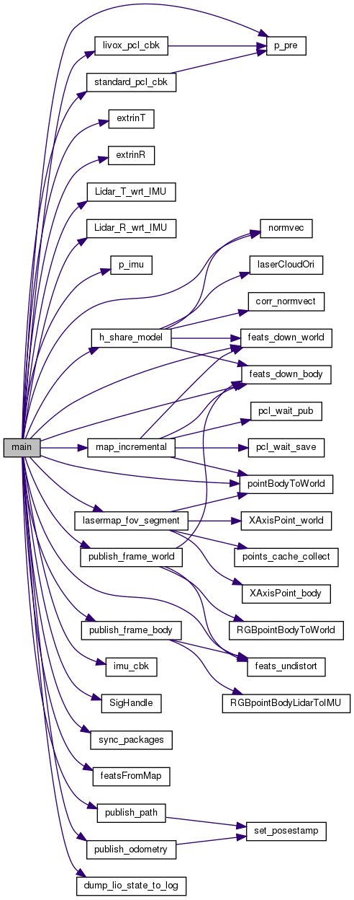

[toc]

# FAST-LIO

## 配置运行

### 参数设置

## 现有激光雷达里程计和建图面临的问题

**（1）数据量大**

LiDAR传感器每秒产生大量3D点，从数十万到数百万不等。在有限的机载计算资源下实时处理如此大量的数据，对激光雷达里程计的计算效率提出了很高的要求

**（2）特征提取不稳定**

为了减少计算量，通常基于局部光滑性提取特征点，如边缘点或平面点，然而，特征提取模块的性能容易受到环境的影响。例如，在没有大平面或长边缘的无结构环境中，特征提取会导致特征点较少。对于视场（FOV）很小的固态激光雷达，这种情况会更加严重。此外，根据扫描模式（如旋转、基于棱镜的、基于mems的）和点密度不同，LiDAR点云的特征提取也有所不同，因此采用激光雷达里程计通常需要大量的手工工作。

**（3）运动畸变**

激光雷达点的采样通常是连续的，而传感器经历连续的运动。这一过程造成了严重的运动失真，影响了里程计和映射的性能，特别是当运动是严重的。惯性测量单元(imu)可以缓解这个问题，但引入了额外的状态(如偏差、外部)来估计

**（4）需要维护大而密集、可实时更新的地图**

激光雷达通常有一个很长的测量范围（例如，数百米），但在扫描中扫描线之间的分辨率相当低。生成的点云测量稀疏地分布在一个大的3D空间中，需要一个大而密集的地图来登记这些稀疏点。此外，地图需要支持有效的查询通信搜索，同时实时更新，纳入新的测量。

## 算法框架及流程

### 系统概述

FAST-LIO2是一种快速、稳健且多功能的LiDAR惯性里程计框架。FAST-LIO2建立在高效紧耦合迭代卡尔曼滤波器的基础上，可实现快速、稳健和精确的LiDAR导航和建图。

### 两个关键创新

**（1）直接将原始点注册到地图，随后更新地图，而不提取特征**

这可以利用环境中的细微特征，从而提高准确性。消除手动设计的特征提取模块，使系统自然适应不同扫描模式的新兴激光雷达传感器。这使得即使在剧烈运动和非常混乱的环境中，扫描配准也更加准确可靠。

**（2）通过增量 k-d 树数据结构 ikd-Tree 维护地图，该结构支持增量更新（即点插入、删除）和动态重新平衡**

与现有的动态数据结构（octree、R∗-tree、nanoflann k-d tree）相比，ikd-Tree 在整体性能优越的同时自然支持对树的下采样。

### 算法框架



（1）ROS节点参数设置

（2）变量定义和初始化，esekf初始化

```C++
kf.init_dyn_share(get_f, df_dx, df_dw, h_share_model, NUM_MAX_ITERATIONS, epsi);
```

（3）设置日志文件等输出文件

（4）ROS订阅和发布话题的设置

（5）进入主循环

sync_packages(Measures)；如果返回true则执行以下操作

第一帧初始化后直接跳过

处理IMU数据 p_imu->Process(Measures, kf, feats_undistort);

lasermap_fov_segment();

### 输入输出接口

在laserMapping.cpp文件的main()函数中

```c++
FILE *fp;
string pos_log_dir = root_dir + "/Log/pos_log.txt";
fp = fopen(pos_log_dir.c_str(),"w");
ofstream fout_pre, fout_out, fout_dbg;
fout_pre.open(DEBUG_FILE_DIR("mat_pre.txt"),ios::out);
fout_out.open(DEBUG_FILE_DIR("mat_out.txt"),ios::out);
fout_dbg.open(DEBUG_FILE_DIR("dbg.txt"),ios::out);
```

位姿文件pos_log.txt是否输出由runtime_pos_log变量控制，该变量由传入的ros参数runtime_pos_log_enable确定，默认是nh.param<bool>("runtime_pos_log_enable", runtime_pos_log, 0), 可通过更改launch文件中的参数实现

```bash
<param name="runtime_pos_log_enable" type="bool" value="1" />
```

`pos_log.txt`位姿日志文件的输入内容由`laserMapping.cpp`文件中的`dump_lio_state_to_log`函数给出

```C++
inline void dump_lio_state_to_log(FILE *fp);
```

mapping_avia.launch文件中关于位姿文件的设置，value设为1

```bash
<param name="runtime_pos_log_enable" type="bool" value="1" />
```

输入接口订阅的数据类型是自定义的吗？CustomMsg

## 状态估计

### 状态转移模型

|                             符号                             |                             含义                             |
| :----------------------------------------------------------: | :----------------------------------------------------------: |
|                           ${t_k}$                            |                 第 k 次激光雷达扫描结束时刻                  |
|                          ${\tau_i}$                          |               激光雷达扫描的第 i 个IMU采样时间               |
|                          ${\rho_i}$                          |           第 j 个特征点在激光雷达扫描中的采样时间            |
|                  ${I_i}$、${I_j}$、${I_k}$                   |                                                              |
|                       ${L_j}$、${L_k}$                       |                                                              |
| $\boldsymbol{x}$、$\hat {\boldsymbol{x}}$、$\bar {\boldsymbol{x}}$ |                状态向量的真值、传播值、更新值                |
|                  $\tilde {\boldsymbol{x}}$                   | 状态向量的真值 $\boldsymbol{x}$ 与估计值 $$\bar {\boldsymbol{x}}$$ 之间的误差 |
|              ${\hat {\boldsymbol{x}}^\kappa }$               |                                                              |
| ${\boldsymbol{x}_i}$、${\boldsymbol{x}_j}$、${\boldsymbol{x}_k}$ |                                                              |
|                                                              |                                                              |


**流形：**${M \triangleq SO(3) \times {\mathbb{R}^{15}} \times SO(3) \times {\mathbb{R}^3},{\text{ }}\dim (M) = 24}$

**输入：**${\boldsymbol{u} \buildrel \Delta \over = {\left[ {\matrix{
   {\boldsymbol{\omega} _m^{\rm{T}}} & {\boldsymbol{a}_m^{\rm{T}}}  \cr 
 } } \right]^{\rm{T}}}}$

**状态向量：**${\boldsymbol{x}} \buildrel \Delta \over = \left[ {\matrix{
   {^G\boldsymbol{R}_I^{\rm{T}}} & {^G\boldsymbol{p}_I^{\rm{T}}} & {^G\boldsymbol{v}_I^{\rm{T}}} & {\boldsymbol{b}_\boldsymbol{\omega} ^{\rm{T}}} & {\boldsymbol{b}_\boldsymbol{a}^{\rm{T}}} & {^G{\boldsymbol{g}^{\rm{T}}}} & {^I\boldsymbol{R}_L^{\rm{T}}} & {^I\boldsymbol{p}_L^{\rm{T}}} } } \right] \in M$

**噪声向量：**${\boldsymbol{w} \buildrel \Delta \over = {\left[ {\matrix{
   {\boldsymbol{n_\omega} ^{\rm{T}}} & {\boldsymbol{n_a}^{\rm{T}}} & {\boldsymbol{n_{b\omega }}^{\rm{T}}} & {\boldsymbol{n_{ba}}^{\rm{T}}} } } \right]^{\rm{T}}}}$ 

左边能合并单元格就好了

|              |                             符号                             |                含义                |
| ------------ | :----------------------------------------------------------: | :--------------------------------: |
| **输入**     |                                                              |                                    |
|              |                                                              |                                    |
| **状态向量** |    $({^G\boldsymbol{R}_I},\text{ }{^G\boldsymbol{p}_I})$     |     **IMU在全局框架中的位姿**      |
|              |                    ${^G{\boldsymbol{g}}}$                    |     **全局坐标系中的重力矢量**     |
|              |                    ${^G\boldsymbol{v}_I}$                    |                                    |
|              | $^I\boldsymbol{T}_L = {(^I}{\boldsymbol{R}}_L,{{\text{ }}^I}\boldsymbol{p}_L)$ | **LiDAR传感器和IMU之间的外参变换** |
|              | ${\boldsymbol{b}_\boldsymbol{\omega}}、 {\boldsymbol{b}_\boldsymbol{a}}$ |                                    |
|              |                                                              |                                    |
|              |                                                              |                                    |

**状态转移方程**


$$
{\boldsymbol{x}_{i + 1}} = \boldsymbol{x}_i \boxplus (tf({\boldsymbol{x}_i},{\text{ }}{\boldsymbol{u}_i},{\text{ }}{\boldsymbol{w}_i}))
$$

$$
f(\boldsymbol{x},\text{ }\boldsymbol{u},\text{ }\boldsymbol{w}) 
= \left[ {\begin{array}{*{20}{c}}
  {{\boldsymbol{\omega} _m} - \boldsymbol{b_\omega } - \boldsymbol{n_\omega }} \\ 
  {^G{\boldsymbol{v}_I} + \frac{1}{2}{(^G}{{\boldsymbol{R}}_I}({\boldsymbol{a}_m} - \boldsymbol{b_a} - \boldsymbol{n_a}){ + ^G}{\boldsymbol{g}})\Delta t} \\ 
  {^G{{\boldsymbol{R}}_I}({\boldsymbol{a}_m} - \boldsymbol{b_a} - \boldsymbol{n_a}){ + ^G}{\boldsymbol{g}}} \\ 
  {\boldsymbol{n_{b\omega }}} \\ 
  {\boldsymbol{n_{ba}}} \\ 
  {{\boldsymbol{0}_{3 \times 1}}} \\ 
  {{\boldsymbol{0}_{3 \times 1}}} \\ 
  {{\boldsymbol{0}_{3 \times 1}}} 
\end{array}} \right] \in {\mathbb{R}^{24}}
$$


### 迭代卡尔曼滤波

两个关键步骤：每次IMU测量时的传播和在每次LiDAR扫描时的迭代更新。

这两个步骤都估计流形M上的自然状态，从而避免任何重正化。

由于IMU测量的频率通常高于激光雷达扫描(例如，IMU测量的频率为200Hz，激光雷达扫描的频率为10Hz ~ 100Hz)，因此在更新之前通常要执行多个传播步骤。

### 源码实现

在`include/use-ikfom.hpp`文件中实现，引用`IKFoM_toolkit`文件夹中的工具

|      函数       |     功能     |
| :-------------: | :----------: |
|     `get_f`     |              |
|     `df_dx`     |              |
|     `df_dw`     |              |
| `h_share_model` | 残差计算函数 |

```C++
/**
 * @brief Get the f object
 * @param s 
 * @param in 
 * @return Eigen::Matrix<double, 24, 1> 
 */
Eigen::Matrix<double, 24, 1> get_f(state_ikfom &s, const input_ikfom &in);
```


```c++
/**
 * @brief 
 * @param s  
 * @param ekfom_data 
 */
void h_share_model(state_ikfom &s, esekfom::dyn_share_datastruct<double> &ekfom_data);
```


```C++
kf.init_dyn_share(get_f, df_dx, df_dw, h_share_model, NUM_MAX_ITERATIONS, epsi);
```


## 建图

地图点被组织成一个ikd-Tree，该树以里程计速率合并新的点云扫描而动态增长。为了防止地图的大小不受约束，ikid - tree中只保留LiDAR当前位置周围长为L的大型局部区域中的地图点

### 地图管理


### 树形结构

ikd-Tree是一棵二叉搜索树	


与现有只在叶子节点上存储点的的k-d树不同，ikd-Tree同时在叶节点和内部节点上存储点，以更好地支持动态点插入和树重新平衡。当使用单个k-d树时，这种存储模式也被证明在kNN搜索中更有效，这就是我们的ikd树的情况

用于分割空间的分割轴记录在 axis 中。根植于当前节点的（子）树的**树节点数（包括有效和无效节点）**保留在属性 treesize 中。当点从地图中删除时，节点不会立即从树中删除，而只是将**布尔变量 deleted 设置为 true**。 如果删除了以当前节点为根的整个（子）树，则**将 treedeleted 设置为 true**。 从（子）树中**删除的点的数目**汇总于属性 invalidnum 中。 属性 range 记录了（子）树上**点的范围信息**，被解释为包含所有点的受限制的轴对齐长方体。 受限制的长方体由其两个对角线顶点表示，每个顶点分别具有最小和最大坐标。

## 参考资源

 [FAST-LIO A Fast, Robust LiDAR-inertial Odometry Package by Tightly-Coupled Iterated Kalman Filter.pdf](papers/fast-lio/FAST-LIO A Fast, Robust LiDAR-inertial Odometry Package by Tightly-Coupled Iterated Kalman Filter.pdf) 

[https://github.com/hku-mars/FAST_LIO](https://github.com/hku-mars/FAST_LIO)

[https://zhuanlan.zhihu.com/p/471876531](https://zhuanlan.zhihu.com/p/471876531)

