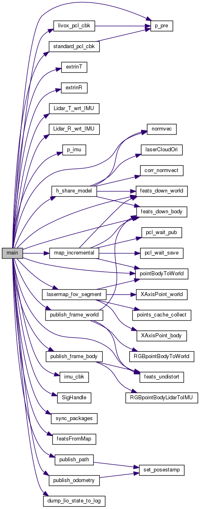

# FAST-LIO配置运行与算法框架


## 配置运行

### 参数设置


## 现有激光雷达里程计和建图面临的问题

**（1）数据量大**

LiDAR传感器每秒产生大量3D点，从数十万到数百万不等。在有限的机载计算资源下实时处理如此大量的数据，对激光雷达里程计的计算效率提出了很高的要求

**（2）特征提取不稳定**

为了减少计算量，通常基于局部光滑性提取特征点，如边缘点或平面点，然而，特征提取模块的性能容易受到环境的影响。例如，在没有大平面或长边缘的无结构环境中，特征提取会导致特征点较少。对于视场（FOV）很小的固态激光雷达，这种情况会更加严重。此外，根据扫描模式（如旋转、基于棱镜的、基于mems的）和点密度不同，LiDAR点云的特征提取也有所不同，因此采用激光雷达里程计通常需要大量的手工工作。

**（3）运动畸变**

激光雷达点的采样通常是连续的，而传感器经历连续的运动。这一过程造成了严重的运动失真，影响了里程计和映射的性能，特别是当运动是严重的。惯性测量单元(imu)可以缓解这个问题，但引入了额外的状态(如偏差、外部)来估计

**（4）需要维护大而密集、可实时更新的地图**

激光雷达通常有一个很长的测量范围（例如，数百米），但在扫描中扫描线之间的分辨率相当低。生成的点云测量稀疏地分布在一个大的3D空间中，需要一个大而密集的地图来**登记**这些稀疏点。此外，地图需要支持有效的查询通信搜索，同时实时更新，纳入新的测量。

## 算法框架及流程

### 系统概述

FAST-LIO2是一种快速、稳健且多功能的LiDAR惯性里程计框架。FAST-LIO2建立在高效紧耦合迭代卡尔曼滤波器的基础上，可实现快速、稳健和精确的LiDAR导航和建图。

### 两个关键创新

**（1）直接将原始点注册到地图，随后更新地图，而不提取特征**

这可以利用环境中的细微特征，从而提高准确性。消除手动设计的特征提取模块，使系统自然适应不同扫描模式的新兴激光雷达传感器。这使得即使在剧烈运动和非常混乱的环境中，扫描配准也更加准确可靠。

**（2）通过增量 k-d 树数据结构 ikd-Tree 维护地图，该结构支持增量更新（即点插入、删除）和动态重新平衡**

与现有的动态数据结构（octree、R∗-tree、nanoflann k-d tree）相比，ikd-Tree 在整体性能优越的同时自然支持对树的下采样。

### 



（1）ROS节点参数设置

（2）变量定义和初始化，esekf初始化

```C++
kf.init_dyn_share(get_f, df_dx, df_dw, h_share_model, NUM_MAX_ITERATIONS, epsi);
```

（3）设置日志文件等输出文件

（4）ROS订阅和发布话题的设置

（5）进入主循环

sync_packages(Measures)；如果返回true则执行以下操作

第一帧初始化后直接跳过

处理IMU数据 p_imu->Process(Measures, kf, feats_undistort);

lasermap_fov_segment();

### 输入输出接口

在laserMapping.cpp文件的main()函数中

```c++
FILE *fp;
string pos_log_dir = root_dir + "/Log/pos_log.txt";
fp = fopen(pos_log_dir.c_str(),"w");
ofstream fout_pre, fout_out, fout_dbg;
fout_pre.open(DEBUG_FILE_DIR("mat_pre.txt"),ios::out);
fout_out.open(DEBUG_FILE_DIR("mat_out.txt"),ios::out);
fout_dbg.open(DEBUG_FILE_DIR("dbg.txt"),ios::out);
```

位姿文件pos_log.txt是否输出由runtime_pos_log变量控制，该变量由传入的ros参数runtime_pos_log_enable确定，默认是nh.param<bool>("runtime_pos_log_enable", runtime_pos_log, 0), 可通过更改launch文件中的参数实现

```bash
<param name="runtime_pos_log_enable" type="bool" value="1" />
```

`pos_log.txt`位姿日志文件的输入内容由`laserMapping.cpp`文件中的`dump_lio_state_to_log`函数给出

```C++
inline void dump_lio_state_to_log(FILE *fp);
```

mapping_avia.launch文件中关于位姿文件的设置，value设为1

```bash
<param name="runtime_pos_log_enable" type="bool" value="1" />
```

输入接口订阅的数据类型是自定义的吗？CustomMsg