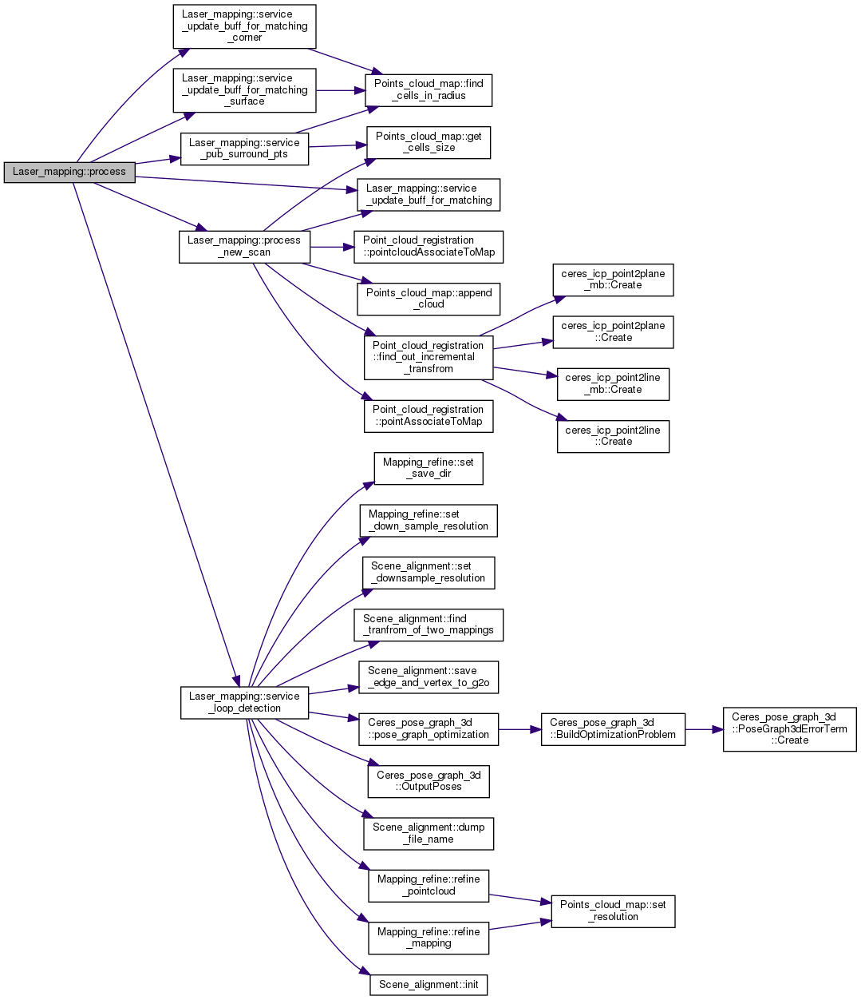
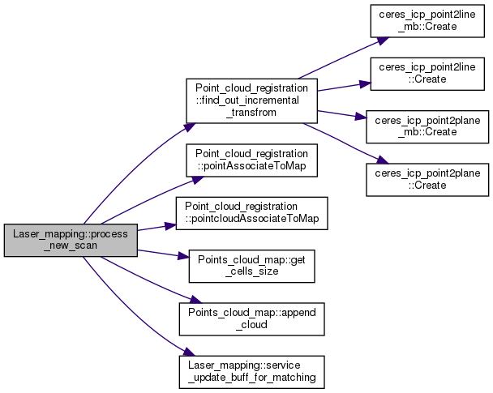

# LOAM-Livox配置运行与算法框架

## 配置运行

### 安装配置

#### 依赖库

ROS、PCL、Ceres、OpenCV

#### 编译可能存在的问题

```{error}
对 ‘`cv::Mat::updateContinuityFlag()`’ 未定义的引用
```

**问题原因：** `CMakeLists.txt`文件`target_link_libraries`时没有添加`OpenCV`库

**解决方法：** 按如下方式更改`CMakeLists.txt`源码

```cmake
add_executable(livox_laserMapping source/laser_mapping.cpp )
target_link_libraries(livox_laserMapping ${catkin_LIBRARIES} ${PCL_LIBRARIES} ${CERES_LIBRARIES} )

# 更改为
add_executable(livox_laserMapping source/laser_mapping.cpp )
target_link_libraries(livox_laserMapping ${catkin_LIBRARIES} ${PCL_LIBRARIES} ${CERES_LIBRARIES} ${OpenCV_LIBS})
```

### 两种launch方法

#### Directly run

|   launch文件   |          配置文件           |
| :------------: | :-------------------------: |
| `livox.launch` | `performance_realtime.yaml` |

```bash
roslaunch loam_livox livox.launch
roslaunch livox_ros_driver livox_lidar.launch
```

#### rosbag launch

|   launch文件    |           配置文件           |
| :-------------: | :--------------------------: |
| `rosbag.launch` | `performance_precision.yaml` |

```bash
roslaunch loam_livox rosbag.launch
rosbag play YOUR_DOWNLOADED.bag
```

#### 参数设置

**Loam-Livox运行时的一些参数在ros功能包的launch文件和config文件下的yaml文件里面设置**

**输入输出的接口都在livox_laserMapping线程**

输入参数在ros功能包的launch文件中有体现，下面是rosbag.launch的内容

```bash
<rosparam command="load" file="$(find loam_livox)/config/performance_precision.yaml" />
<param name="common/pcd_save_dir" type="string" value="$(env HOME)/Loam_livox" />
<param name="common/log_save_dir" type="string" value="$(env HOME)/Loam_livox" />
<param name="common/loop_save_dir" type="string" value="$(env HOME)/Loam_livox" />
```

## 固态激光雷达的问题

## 算法框架及流程

### 系统概述与算法框架




### Loam-Livox的三个ROS节点

#### livox_scanRegistration节点

在Laser_feature类的成员函数 void laserCloudHandler( const sensor_msgs::PointCloud2ConstPtr &laserCloudMsg, const std::string & topic_name )中，通过发布话题，三个成员变量 ros::Publisher  m_pub_pc_livox_corners, m_pub_pc_livox_surface, m_pub_pc_livox_full发布话题，消息livox_corners、livox_surface、 livox_full（发布消息的那段代码写到页面上）到pc2_corners、pc2_surface、pc2_full

```c++
  m_pub_pc_livox_corners = nh.advertise<sensor_msgs::PointCloud2>( "/pc2_corners", 10000 );
  m_pub_pc_livox_surface = nh.advertise<sensor_msgs::PointCloud2>( "/pc2_surface", 10000 );
  m_pub_pc_livox_full = nh.advertise<sensor_msgs::PointCloud2>( "/pc2_full", 10000 );
```

**参考：** [**CSDN：从数据流视角解析 loam_livox**](https://blog.csdn.net/weixin_40331125/article/details/106108568)

```C++
   pcl::toROSMsg( *livox_full, temp_out_msg );
   temp_out_msg.header.stamp = current_time;
   temp_out_msg.header.frame_id = "camera_init";
   m_pub_pc_livox_full.publish( temp_out_msg );

   m_voxel_filter_for_surface.setInputCloud( livox_surface );
   m_voxel_filter_for_surface.filter( *livox_surface );
   pcl::toROSMsg( *livox_surface, temp_out_msg );
   temp_out_msg.header.stamp = current_time;
   temp_out_msg.header.frame_id = "camera_init";
   m_pub_pc_livox_surface.publish( temp_out_msg );

   m_voxel_filter_for_corner.setInputCloud( livox_corners );
   m_voxel_filter_for_corner.filter( *livox_corners );
   pcl::toROSMsg( *livox_corners, temp_out_msg );
   temp_out_msg.header.stamp = current_time;
   temp_out_msg.header.frame_id = "camera_init";
   m_pub_pc_livox_corners.publish( temp_out_msg );
```


#### livox_laserMapping节点（主线程）

初始化参数的接口：inline void Laser_mapping::init_parameters(ros::NodeHandle &nh)，在构造函数中调用init_parameters

在Laser_mapping类的构造函数中，通过三个成员变量 ros::Subscriber m_sub_laser_cloud_corner_last, m_sub_laser_cloud_surf_last, m_sub_laser_cloud_full_res;订阅话题，接收消息

**输入输出的接口都在livox_laserMapping线程**

```c++
 //livox_corners
        m_sub_laser_cloud_corner_last = m_ros_node_handle.subscribe<sensor_msgs::PointCloud2>( "/pc2_corners", 10000, &Laser_mapping::laserCloudCornerLastHandler, this );
        m_sub_laser_cloud_surf_last = m_ros_node_handle.subscribe<sensor_msgs::PointCloud2>( "/pc2_surface", 10000, &Laser_mapping::laserCloudSurfLastHandler, this );
        m_sub_laser_cloud_full_res = m_ros_node_handle.subscribe<sensor_msgs::PointCloud2>( "/pc2_full", 10000, &Laser_mapping::laserCloudFullResHandler, this );
```



#### read_camera节点

Laser_feature类的成员变量：m_piecewise_number分段的数目

### 输入输出接口

**输入输出的接口都在livox_laserMapping线程**

输入接口订阅的数据类型是什么样的，是自定义的吗？

## 参考资料

[Loam livox: A fast, robust, high-precision LiDAR odometry and mapping package for LiDARs of small FoV](./papers/Loam-Livox.pdf)

[A fast, complete, point cloud based loop closure for LiDAR odometry and mapping](./papers/Loam-Livox-LoopClosure.pdf)

[**CSDN：快速完整的基于点云闭环检测的激光SLAM系统**](https://blog.csdn.net/qq_40114620/article/details/116241075)

[**古月居：Loam_livox 代码阅读与总结**](https://guyuehome.com/39830)

激光LSAM总结：https://www.it610.com/article/1548921238750040064.htm