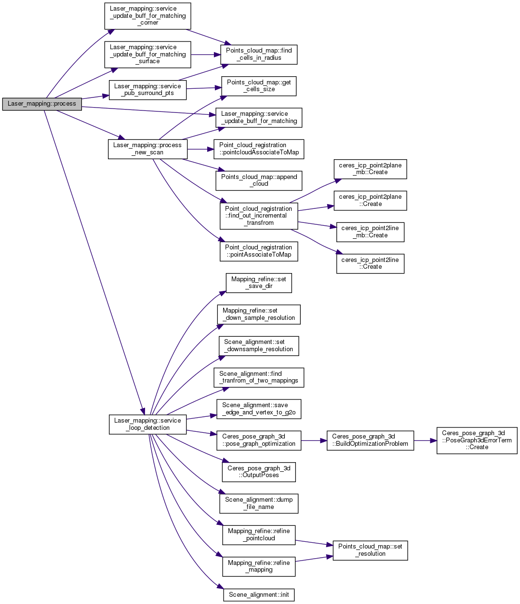
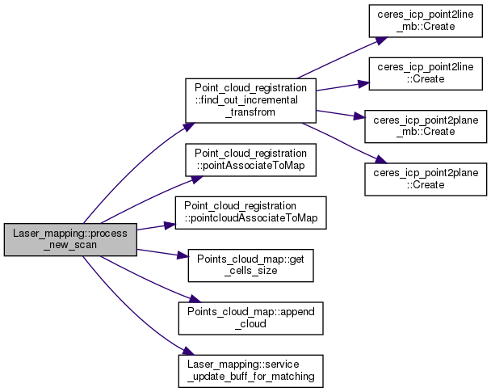
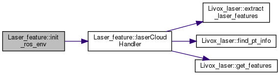
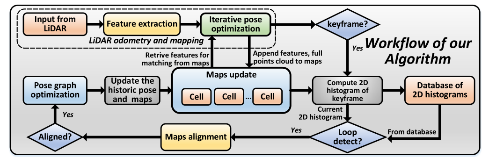

[TOC]

# LOAM-Livox

## 配置运行

### 安装配置

#### 依赖库

ROS、PCL、Ceres、OpenCV

#### 编译可能存在的问题

```{error}
对 ‘`cv::Mat::updateContinuityFlag()`’ 未定义的引用
```

- **问题原因：**CMakeLists.txt文件target_link_libraries时没有添加OpenCV库

- **解决方法：**按如下方式更改CMakeLists.txt源码

```cmake
add_executable(livox_laserMapping source/laser_mapping.cpp )
target_link_libraries(livox_laserMapping ${catkin_LIBRARIES} ${PCL_LIBRARIES} ${CERES_LIBRARIES} )

# 更改为
add_executable(livox_laserMapping source/laser_mapping.cpp )
target_link_libraries(livox_laserMapping ${catkin_LIBRARIES} ${PCL_LIBRARIES} ${CERES_LIBRARIES} ${OpenCV_LIBS})
```

### 两种launch方法

#### Directly run

|  launch文件  |         配置文件          |
| :----------: | :-----------------------: |
| livox.launch | performance_realtime.yaml |

```bash
roslaunch loam_livox livox.launch
roslaunch livox_ros_driver livox_lidar.launch
```

#### rosbag launch

|  launch文件   |          配置文件          |
| :-----------: | :------------------------: |
| rosbag.launch | performance_precision.yaml |

```bash
roslaunch loam_livox rosbag.launch
rosbag play YOUR_DOWNLOADED.bag
```

#### 参数设置

**Loam-Livox运行时的一些参数在ros功能包的launch文件和config文件下的yaml文件里面设置**

**输入输出的接口都在livox_laserMapping线程**

输入参数在ros功能包的launch文件中有体现，下面是rosbag.launch的内容

```bash
<rosparam command="load" file="$(find loam_livox)/config/performance_precision.yaml" />
<param name="common/pcd_save_dir" type="string" value="$(env HOME)/Loam_livox" />
<param name="common/log_save_dir" type="string" value="$(env HOME)/Loam_livox" />
<param name="common/loop_save_dir" type="string" value="$(env HOME)/Loam_livox" />
```

## 固态激光雷达的问题


## 算法框架及流程

### 系统概述与算法框架




### Loam-Livox的三个ROS节点

#### livox_scanRegistration节点

在Laser_feature类的成员函数 void laserCloudHandler( const sensor_msgs::PointCloud2ConstPtr &laserCloudMsg, const std::string & topic_name )中，通过发布话题，三个成员变量 ros::Publisher  m_pub_pc_livox_corners, m_pub_pc_livox_surface, m_pub_pc_livox_full发布话题，消息livox_corners、livox_surface、 livox_full（发布消息的那段代码写到页面上）到pc2_corners、pc2_surface、pc2_full

```c++
  m_pub_pc_livox_corners = nh.advertise<sensor_msgs::PointCloud2>( "/pc2_corners", 10000 );
  m_pub_pc_livox_surface = nh.advertise<sensor_msgs::PointCloud2>( "/pc2_surface", 10000 );
  m_pub_pc_livox_full = nh.advertise<sensor_msgs::PointCloud2>( "/pc2_full", 10000 );
```

**参考：** [**CSDN：从数据流视角解析 loam_livox**](https://blog.csdn.net/weixin_40331125/article/details/106108568)

```C++
   pcl::toROSMsg( *livox_full, temp_out_msg );
   temp_out_msg.header.stamp = current_time;
   temp_out_msg.header.frame_id = "camera_init";
   m_pub_pc_livox_full.publish( temp_out_msg );

   m_voxel_filter_for_surface.setInputCloud( livox_surface );
   m_voxel_filter_for_surface.filter( *livox_surface );
   pcl::toROSMsg( *livox_surface, temp_out_msg );
   temp_out_msg.header.stamp = current_time;
   temp_out_msg.header.frame_id = "camera_init";
   m_pub_pc_livox_surface.publish( temp_out_msg );

   m_voxel_filter_for_corner.setInputCloud( livox_corners );
   m_voxel_filter_for_corner.filter( *livox_corners );
   pcl::toROSMsg( *livox_corners, temp_out_msg );
   temp_out_msg.header.stamp = current_time;
   temp_out_msg.header.frame_id = "camera_init";
   m_pub_pc_livox_corners.publish( temp_out_msg );
```


#### livox_laserMapping节点（主线程）

初始化参数的接口：inline void Laser_mapping::init_parameters(ros::NodeHandle &nh)，在构造函数中调用init_parameters

在Laser_mapping类的构造函数中，通过三个成员变量 ros::Subscriber m_sub_laser_cloud_corner_last, m_sub_laser_cloud_surf_last, m_sub_laser_cloud_full_res;订阅话题，接收消息

**输入输出的接口都在livox_laserMapping线程**

```c++
 //livox_corners
        m_sub_laser_cloud_corner_last = m_ros_node_handle.subscribe<sensor_msgs::PointCloud2>( "/pc2_corners", 10000, &Laser_mapping::laserCloudCornerLastHandler, this );
        m_sub_laser_cloud_surf_last = m_ros_node_handle.subscribe<sensor_msgs::PointCloud2>( "/pc2_surface", 10000, &Laser_mapping::laserCloudSurfLastHandler, this );
        m_sub_laser_cloud_full_res = m_ros_node_handle.subscribe<sensor_msgs::PointCloud2>( "/pc2_full", 10000, &Laser_mapping::laserCloudFullResHandler, this );
```



#### read_camera节点

Laser_feature类的成员变量：m_piecewise_number分段的数目


### 输入输出接口

**输入输出的接口都在livox_laserMapping线程**

输入接口订阅的数据类型是什么样的，是自定义的吗？

## 特征提取



## 位姿优化

## 回环检测

从LiDAR输入的每一帧都通过LOAM算法配准到全局地图，如果已经接收了指定数量的帧(例如100帧)，则创建一个关键帧，形成一个小的本地地图补丁。通过LOAM将与新关键帧相对应的原始点云配准到全局地图中，以计算其2D直方图。将计算得到的2D直方图与数据库进行比较，数据库中包含了过去所有关键帧组成的全局地图的2D直方图，以检测可能发生的回环，同时将新的关键帧2D直方图添加到数据库中，供下一个关键帧使用。一旦检测到回环，则将关键帧与全局图对齐，并进行位姿图优化以纠正全局地图中的漂移。



### map和cell

#### 胞体cell

胞体是通过对三维空间进行划分，形成一个固定大小的小立方体，在x、y、z方向上的尺寸为 ${S_x}$、${S_y}$、${S_z}$，它由中心位置 ${\boldsymbol{C}_c}$ 表示。
$$
{\boldsymbol{C}_c} = \left[ {\matrix{
   {{\rm{round}}({\boldsymbol{P}_{ix}}/{S_x}) \cdot {S_x} + {S_x}/2}  \cr 
   {{\rm{round}}({\boldsymbol{P}_{iy}}/{S_y}) \cdot {S_y} + {S_y}/2}  \cr 
   {{\rm{round}}({\boldsymbol{P}_{iz}}/{S_z}) \cdot {S_z} + {S_z}/2}  \cr 
 } } \right]
$$

$$
{\boldsymbol{C}_\mu } = {1 \over N}\left( {\sum\limits_{i = 1}^N {{\boldsymbol{P}_i}} } \right)
$$

$$
{\boldsymbol{C}_\Sigma } = {1 \over {N - 1}}\left( {\sum\limits_{i = 1}^N {\left( {{\boldsymbol{P}_i} - {\boldsymbol{C}_\mu }} \right){{\left( {{\boldsymbol{P}_i} - {\boldsymbol{C}_\mu }} \right)}^{\rm{T}}}} } \right)
$$

$$
{\boldsymbol{C}} = \left\{ {{\boldsymbol{C}_c},{\ }
{\boldsymbol{C}_\mu },{\ }
{{\boldsymbol{C}}_\Sigma },{\ }
\left\{ {{{\boldsymbol{P}}_i}} \right\}} \right\}
$$


#### 地图map

地图是保存在单元格中的所有原始点的集合。Map由哈希表**H**和全局八叉树**O**组成，通过哈希表**H**可以根据其中心${\boldsymbol{C}_c}$快速找到特定的cell，通过八叉树**O**可以快速找到给定范围内特定区域内的所有cell。

对于新添加的胞体，通过其各个组成部分（中心坐标）的XOR操作来计算得到其哈希索引值。然后将计算出来的哈希索引添加到地图的哈希表**H**中。由于胞体是3D空间的固定分区，因此其中心位置${\boldsymbol{C}_c}$是静态的，不需要更新哈希表中的现有条目(但哈希表是动态增长的)。

新添加的胞体根据其中心坐标被添加到八叉树O，这里的实现类似Octomap的操作。

- **从新帧增量创建胞体和更新地图的算法流程**


### 旋转不变性的2D直方图

我们快速循环检测的主要思想是，我们使用2D图像样的直方图来大致描述关键帧。

二维直方图描述了特征方向的欧拉角在关键帧中的分布

#### 胞体的特征类型和方向


如前所述，每个关键帧由若干帧(如100帧)组成，每一帧(如扫描)被划分为单元格。对于每个单元格，我们确定其点形成的形状和相关的特征方向(记为Cd)。与[15]相似，我们对(3)中的协方差矩阵CΣ进行特征值分解


其中Λ为对角矩阵，特征值降序排列(Λ 1≥Λ 2≥Λ 3)。在实际应用中，我们只考虑5点或5点以上的单元格来增加鲁棒性。

•平面形状的细胞:若λ2明显大于λ3，则将该细胞视为平面形状，并以平面法线为特征方向，即Cd = V3，其中V3为矩阵V的第三列。

•线形细胞:如果细胞不是平面，且λ1明显大于λ2，则将该细胞视为线形，并以线形方向为特征方向，即Cd = V1，即V的第一列。

•没有特征的单元格:既不是直线也不是平面形状的单元格不被考虑。

#### 旋转不变性

为了使我们的特征描述符对关键帧的任意旋转不变量，我们将每个特征方向Cd乘以一个额外的旋转矩阵R，并期望特征方向的大部分位于x轴上，次要的大部分位于Y轴上。由于平面特征比线特征更可靠(例如，将平面特征的边缘作为线特征处理)，我们使用该特征平面单元方向确定旋转矩阵R。

与前几节类似，我们计算关键帧中所有平面特征方向的协方差Σd:

#### 关键帧的2D直方图

利用关键帧中所有单元格旋转不变的特征方向，我们计算二维直方图如下:首先，对于给定的特征方向Cd = [Cdx, Cdy, Cdz]，我们选择X分量为正的方向，即Cd =符号(Cdx)·Cd，然后计算特征方向的欧拉角(如图4)


我们使用的2d直方图是一个60 × 60矩阵(在俯仰和偏航角上都有3个◦分辨率)，这个矩阵的元素表示在相应的bin中具有俯仰θ和偏航φ的线/平面单元的数量。例如，第i行，第j列元素eij为特征方向角度满足的单元格数:


为了提高二维直方图对可能的噪声的鲁棒性，我们对计算得到的每个二维直方图应用高斯模糊。

计算具有旋转不变性的二维直方图的完整算法见算法2

### 快速回环检测


loam-livox回环：

[**CSDN：快速完整的基于点云闭环检测的激光SLAM系统**](https://blog.csdn.net/qq_40114620/article/details/116241075)

[**古月居：Loam_livox 代码阅读与总结**](https://guyuehome.com/39830)

激光LSAM总结：https://www.it610.com/article/1548921238750040064.htm
