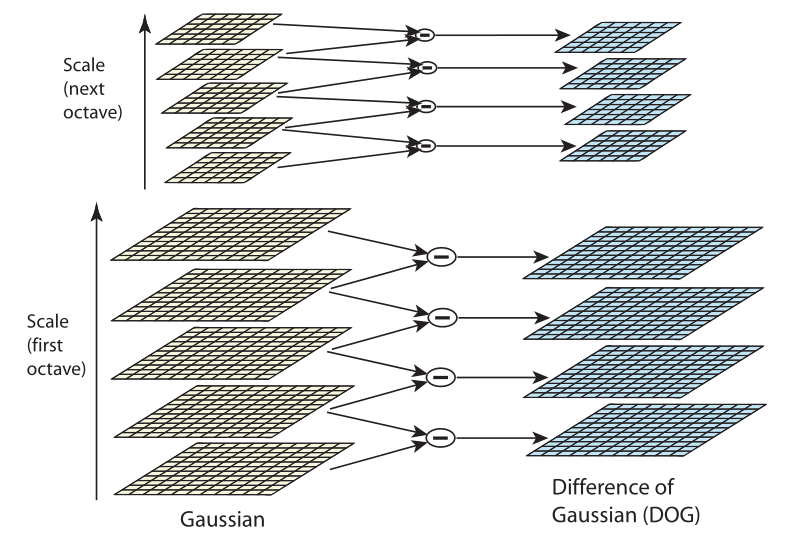
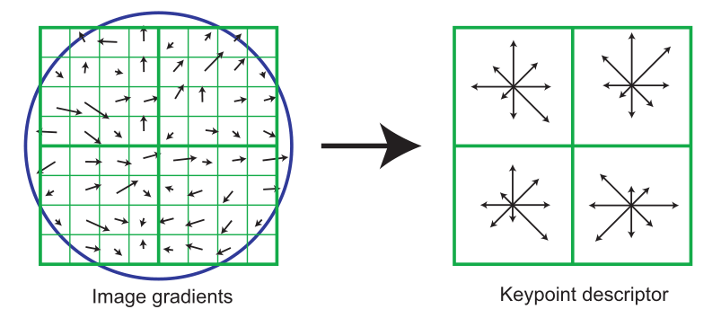

# 特征提取与匹配

## 图像特征

关键点和描述子

常用描述子的维数：BRIEF、sift等等，以及描述子之间的距离定义：L2，汉明距离等等

角点与斑点

| 角点       |      | 描述子 | OpenCV |
| ---------- | ---- | ------ | ------ |
| FAST       |      |        |        |
| Shi-Tomasi |      |        |        |
| Harris     |      |        |        |

| 特征点 | 关键点 | 描述子       | OpenCV | 特点 |
| ------ | ------ | ------------ | ------ | ---- |
| SIFT   |        | 128维CV32UC4 |        |      |
| SURF   |        |              |        |      |
| ORB    |        |              |        |      |

**PCA-SIFT和GLOH**

### 特征点与描述子

### SIFT

RootSIFT??

#### 尺度空间极值检测

级联过滤方法检测关键点。通过使用被称为尺度空间的连续尺度函数，在所有可能的尺度上搜索稳定特征，实现对图像尺度变化不变的位置的检测。

- **尺度空间 $L(x,y,\sigma)$**

变尺度高斯函数 ${G(x,y)}$ 与图像 ${I(x,y)}$ 的卷积

$$
L(x,y,\sigma ) = G(x,y,\sigma) \cdot I(x,y)
$$

$$
G(x,y) = {1 \over {2\pi {\sigma ^2}}}{e^{ - ({x^2} + {y^2})/2{\sigma ^2}}}
$$

- **高斯差分函数（Difference of Gaussian, DOG）**

实现有效检测尺度空间中稳定的关键点位置，该函数是由常数乘因子${k}$分隔的两个相邻尺度的差分

$$
D(x,y,\sigma ) = (G(x,y,k\sigma ) - G(x,y,\sigma )) \cdot I(x,y) = L(x,y,k\sigma ) - L(x,y,\sigma )
$$

- **高斯金字塔与高斯差分金字塔**

**a）初始图像与高斯函数进行增量卷积，生成被常数因子 $k$ 分隔的尺度空间图像集。将尺度空间的每个octave(即σ的两倍)分成一个整数s，即k = 21/s**

**b）对于尺度空间的每个octave，将初始图像与高斯函数进行反复卷积，生成左图所示的尺度空间图像集。对相邻的高斯图像进行相减，得到右边的高斯图像差。**

**c）处理完一个完整的octave后，降采样高斯图像（宽高各取原图像的1/2）并重复该过程**

#### 关键点定位

#### 方向分配

根据局部图像属性为每个关键点分配一致（**一致是什么意思？？？**）的方向，关键点描述子可以相对于该方向表示，从而实现对图像的旋转不变性。

- **梯度幅值 $m(x, y)$ 和方向 $\theta (x, y)$ **

选择尺度最接近关键点尺度的高斯平滑图像 $L$，使所有的计算都以尺度不变的方式进行，每个图像样本 $L(x, y)$ 在该尺度下的梯度幅值 $m(x, y)$ 和方向 $\theta (x, y)$ 表示为

$$
\eqalign{
  & m(x,\ y) = \sqrt {{{(L(x + 1,\ y) - L(x - 1,\ y))}^2} + {{(L(x,\ y + 1) - L(x,\ y - 1))}^2}} \cr 
  & \theta (x,\ y) = {\tan ^{ - 1}}[(L(x,\ y + 1) - L(x,\ y - 1))/(L(x + 1,\ y) - L(x - 1,\ y))] \cr}
$$

- **方向直方图**

方向直方图由关键点周围区域内样本点的梯度方向组成，分为36个bins，覆盖0~360°方向范围。每个添加到直方图的样本由其梯度大小和高斯加权圆窗口加权，$\sigma$ 是关键点尺度的1.5倍

- **关键点的3个信息：位置、尺度、方向**

关键点包含3个信息：位置 $(x,y)$ 、尺度 $\sigma$ 、方向 $\theta$ ，通常使用一个带箭头的圆或直接使用箭头表示SIFT区域的三个值：中心表示特征点位置，半径表示关键点尺度（ $r=2.5σ$ ）,箭头表示主方向。具有多个方向的关键点可以复制成多份

#### 关键点描述子

通过在关键点位置周围的区域中计算每个图像样本点的梯度大小和方向，创建一个关键点描述子，如左图所示。这些由高斯窗口加权，由叠加的圆表示。然后，这些样本被累积成汇总4x4个子区域内容的方向直方图，如图右所示，每个箭头的长度对应于该区域内该方向附近的梯度大小之和。下图显示了从8x8样本集计算出的2x2描述符数组，而SIFT实际使用从16x16样本数组计算出的4x4描述子

[**Bilibili：SIFT(尺度不变特征变换)**](https://www.bilibili.com/video/BV1Qb411W7cK?p=4&share_source=copy_pc)

[**GitHub：image-processing-from-scratch**](https://github.com/o0o0o0o0o0o0o/image-processing-from-scratch)

[**CSDN：理解SIFT**](https://blog.csdn.net/hltt3838/article/details/105912689?ops_request_misc=%257B%2522request%255Fid%2522%253A%2522166869505016782425198076%2522%252C%2522scm%2522%253A%252220140713.130102334..%2522%257D&request_id=166869505016782425198076&biz_id=0&utm_medium=distribute.pc_search_result.none-task-blog-2~all~sobaiduend~default-1-105912689-null-null.142^v65^opensearch_v2,201^v3^control_1,213^v2^t3_control1&utm_term=%E7%90%86%E8%A7%A3sift&spm=1018.2226.3001.4187)

[**CSDN：SIFT特征点提取及描述论文算法详解**](https://blog.csdn.net/Robert_Q/article/details/118003686)

[**CSDN：SIFT经典论文翻译版**](https://blog.csdn.net/lavender19/article/details/120396145?spm=1001.2101.3001.6650.6&utm_medium=distribute.pc_relevant.none-task-blog-2%7Edefault%7EBlogCommendFromBaidu%7ERate-6-120396145-blog-118003686.pc_relevant_3mothn_strategy_recovery&depth_1-utm_source=distribute.pc_relevant.none-task-blog-2%7Edefault%7EBlogCommendFromBaidu%7ERate-6-120396145-blog-118003686.pc_relevant_3mothn_strategy_recovery&utm_relevant_index=11)

### SURF

### ORB

## 特征匹配

剔除特征匹配的一般流程

lowe's比值测试

对极约束（findFoundmental）

交叉匹配

## OpenCV特征提取与匹配

cv::keypoint类的成员变量包括哪些：位置、方向、角度、金字塔层数？？

KeyPoint类及其内部结构

DMatch类及其内部结构

Mat Descriptor类及其内部结构（行数表示描述子的数目，列数表示描述子的维数）

[OpenCV](./第三方库#OpenCV)

[特征匹配](#特征匹配)

**不同于brief描述子的uchar类型，sift和surf均采用float型。所以ORB(brief)描述子8维，32bytes（256bits）,CV_8UC1。SIFT描述子128维，512bytes，CV_32UC4（512*8/32 = 32*4，第一个32表示描述子Mat是32列，第二个32表示float类型）。SURF描述子64维，256bytes，CV_32UC2。（OpenCV里compute的描述子的列数都是32）**
————————————————
版权声明：本文为CSDN博主「cc_sunny」的原创文章，遵循CC 4.0 BY-SA版权协议，转载请附上原文出处链接及本声明。
原文链接：https://blog.csdn.net/aptx704610875/article/details/51503149

## 场景

如何区分丰富纹理和弱纹理？

什么特征点对弱纹理更加鲁棒？