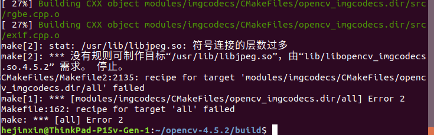

# OpenCV

Opencv命令行参数cv::CommandLineParser：

https://blog.csdn.net/kasteluo/article/details/86621951

https://docs.opencv.org/4.5.2/d0/d2e/classcv_1_1CommandLineParser.html


注意cv::Mat::Size(cols,rows)的格式，列数在前，行数在后https://blog.csdn.net/weixin_47156401/article/details/120023261


图片转换cvtColor、图片的通道数、BGR和RGB、RGBA，灰度图可以三通道吗

## 安装配置与卸载

- **安装和查看版本**

[CSDN：Ubuntu18.04安装Opencv4.5.2](https://blog.csdn.net/qq_17769915/article/details/124087687)

```bash
pkg-config  --libs opencv  # 查看libs库
pkg-config  --modversion  opencv # 查看版本号
```



- **卸载**

[CSDN：wsl+opencv——清除旧版并安装新版，实测有效](https://blog.csdn.net/m0_51984869/article/details/127538531)

## cv::Mat类

## 浅拷贝与深拷贝

## 图片读取、显示、调整大小resize、与转换

cv::imread

cv::imwrite

imshow

resize

cv::cvtColor


通道处理BRG2RGB，BGRA等等

## 图片滤波

# Eigen

如何查看Eigen版本