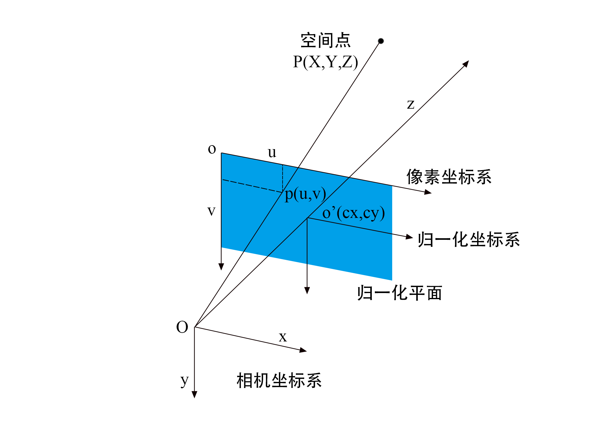

[TOC]

概述：https://www.it610.com/article/1548921238750040064.htm

# 传感器系列

## 相机

### 相机模型

#### 针孔相机模型

<figure style="text-align: center;">
  <figcaption>针孔相机模型</figcaption>
</figure>

$$
s\boldsymbol{u} = \boldsymbol{K}
\left[ {\matrix{\boldsymbol{R} & \boldsymbol{t} \cr } } \right]
\left[ {\matrix{\boldsymbol{P} \cr 1  \cr } } \right]
$$

$$
\boldsymbol{K} = \left[ {\matrix{
   {{f_x}} & 0 & {{c_x}}  \cr 
   0 & {{f_y}} & {{c_y}}  \cr 
   0 & 0 & 1  \cr 
 } } \right],{\ }
\boldsymbol{u} = \left[ {\matrix{
   u  \cr 
   v  \cr 
   1  \cr 
 } } \right],{\ }
\boldsymbol{P} = {\left[ {\matrix{
   X  \cr 
   Y  \cr 
   Z  \cr 
 } } \right]_\rm{world}}
$$

#### 畸变模型

去畸变

Opencv中的去畸变函数

### 相机分类

运动相机insta和gopro

https://zhuanlan.zhihu.com/p/371410573

## 激光雷达

**livox系列、velodyne系列**

### 机械旋转式激光雷达

### 固态激光雷达

## IMU

## 视觉SLAM与激光SLAM的优劣对比

