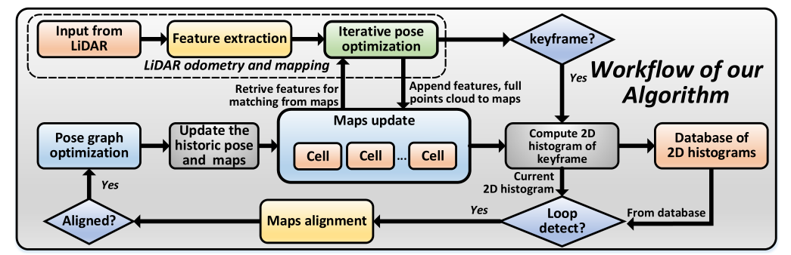
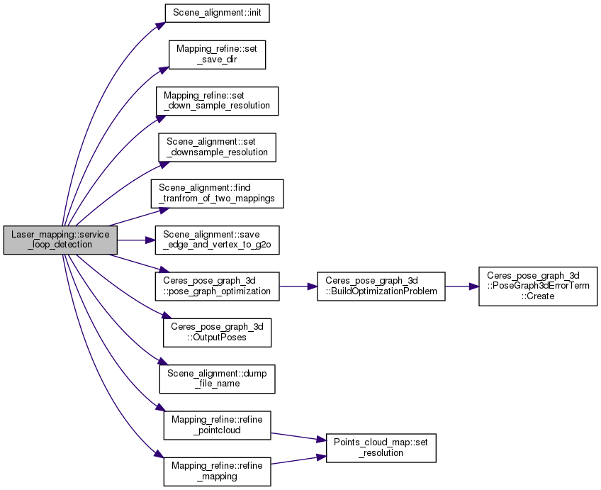

# LOAM-Livox回环检测模块

从LiDAR输入的每一帧都通过LOAM算法配准到全局地图，如果已经接收了指定数量的帧(例如100帧)，则创建一个关键帧，形成一个小的本地地图补丁。通过LOAM将与新关键帧相对应的原始点云配准到全局地图中，以计算其2D直方图。将计算得到的2D直方图与数据库进行比较，数据库中包含了过去所有关键帧组成的全局地图的2D直方图，以检测可能发生的回环，同时将新的关键帧2D直方图添加到数据库中，供下一个关键帧使用。一旦检测到回环，则将关键帧与全局图对齐，并进行位姿图优化以纠正全局地图中的漂移。

## map和cell

### 胞体cell

胞体是通过对三维空间进行划分，形成一个固定大小的小立方体，在x、y、z方向上的尺寸为 ${S_x}$、${S_y}$、${S_z}$，它由中心位置 ${\boldsymbol{C}_c}$ 表示。
$$
{\boldsymbol{C}_c} = \left[ {\matrix{
   {{\rm{round}}({\boldsymbol{P}_{ix}}/{S_x}) \cdot {S_x} + {S_x}/2}  \cr 
   {{\rm{round}}({\boldsymbol{P}_{iy}}/{S_y}) \cdot {S_y} + {S_y}/2}  \cr 
   {{\rm{round}}({\boldsymbol{P}_{iz}}/{S_z}) \cdot {S_z} + {S_z}/2}  \cr 
 } } \right]
$$

$$
{\boldsymbol{C}_\mu } = {1 \over N}\left( {\sum\limits_{i = 1}^N {{\boldsymbol{P}_i}} } \right)
$$

$$
{\boldsymbol{C}_\Sigma } = {1 \over {N - 1}}\left( {\sum\limits_{i = 1}^N {\left( {{\boldsymbol{P}_i} - {\boldsymbol{C}_\mu }} \right){{\left( {{\boldsymbol{P}_i} - {\boldsymbol{C}_\mu }} \right)}^{\rm{T}}}} } \right)
$$

$$
{\boldsymbol{C}} = \left\{ {{\boldsymbol{C}_c},{\ }
{\boldsymbol{C}_\mu },{\ }
{{\boldsymbol{C}}_\Sigma },{\ }
\left\{ {{{\boldsymbol{P}}_i}} \right\}} \right\}
$$

### 地图map

地图是保存在单元格中的所有原始点的集合。Map由哈希表**H**和全局八叉树**O**组成，通过哈希表**H**可以根据其中心${\boldsymbol{C}_c}$快速找到特定的cell，通过八叉树**O**可以快速找到给定范围内特定区域内的所有cell。

对于新添加的胞体，通过其各个组成部分（中心坐标）的XOR操作来计算得到其哈希索引值。然后将计算出来的哈希索引添加到地图的哈希表**H**中。由于胞体是3D空间的固定分区，因此其中心位置${\boldsymbol{C}_c}$是静态的，不需要更新哈希表中的现有条目(但哈希表是动态增长的)。

新添加的胞体根据其中心坐标被添加到八叉树O，这里的实现类似Octomap的操作。

- **从新帧增量创建胞体和更新地图的算法流程**

## 旋转不变性的2D直方图

我们快速循环检测的主要思想是，我们使用2D图像样的直方图来大致描述关键帧。

二维直方图描述了特征方向的欧拉角在关键帧中的分布

### 胞体的特征类型和方向

如前所述，每个关键帧由若干帧(如100帧)组成，每一帧(如扫描)被划分为单元格。对于每个单元格，我们确定其点形成的形状和相关的特征方向(记为Cd)。与[15]相似，我们对(3)中的协方差矩阵CΣ进行特征值分解

其中Λ为对角矩阵，特征值降序排列(Λ 1≥Λ 2≥Λ 3)。在实际应用中，我们只考虑5点或5点以上的单元格来增加鲁棒性。

•平面形状的细胞:若λ2明显大于λ3，则将该细胞视为平面形状，并以平面法线为特征方向，即Cd = V3，其中V3为矩阵V的第三列。

•线形细胞:如果细胞不是平面，且λ1明显大于λ2，则将该细胞视为线形，并以线形方向为特征方向，即Cd = V1，即V的第一列。

•没有特征的单元格:既不是直线也不是平面形状的单元格不被考虑。

### 旋转不变性

为了使我们的特征描述符对关键帧的任意旋转不变量，我们将每个特征方向Cd乘以一个额外的旋转矩阵R，并期望特征方向的大部分位于x轴上，次要的大部分位于Y轴上。由于平面特征比线特征更可靠(例如，将平面特征的边缘作为线特征处理)，我们使用该特征平面单元方向确定旋转矩阵R。

与前几节类似，我们计算关键帧中所有平面特征方向的协方差Σd:

### 关键帧的2D直方图

利用关键帧中所有单元格旋转不变的特征方向，我们计算二维直方图如下:首先，对于给定的特征方向Cd = [Cdx, Cdy, Cdz]，我们选择X分量为正的方向，即Cd =符号(Cdx)·Cd，然后计算特征方向的欧拉角(如图4)

我们使用的2d直方图是一个60 × 60矩阵(在俯仰和偏航角上都有3个◦分辨率)，这个矩阵的元素表示在相应的bin中具有俯仰θ和偏航φ的线/平面单元的数量。例如，第i行，第j列元素eij为特征方向角度满足的单元格数:

为了提高二维直方图对可能的噪声的鲁棒性，我们对计算得到的每个二维直方图应用高斯模糊。

计算具有旋转不变性的二维直方图的完整算法见算法2

## 快速回环检测

loam-livox回环：